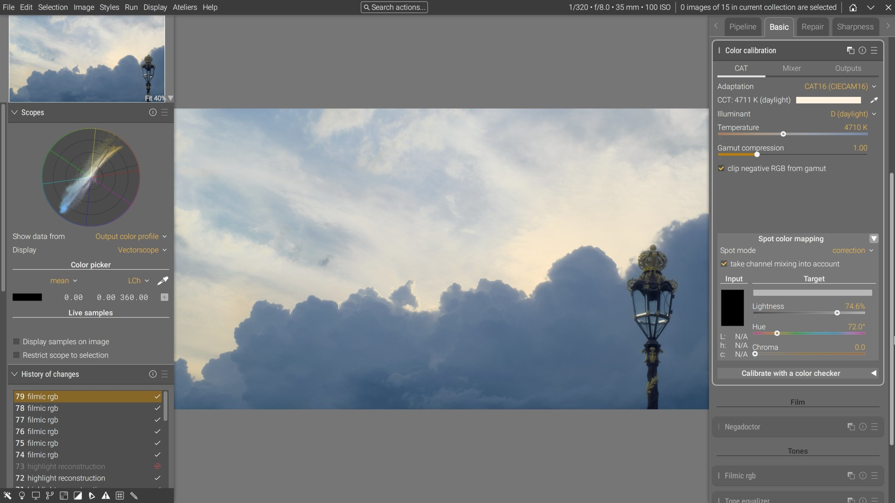
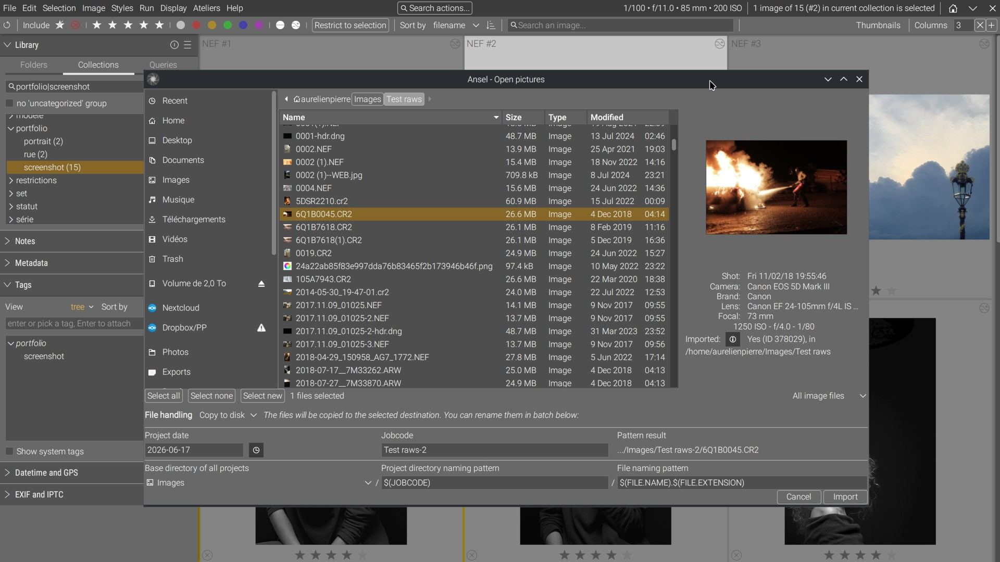
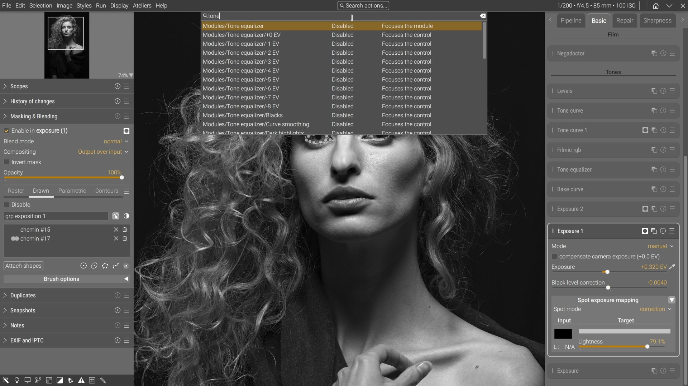

# Ansel

[](https://github.com/aurelienpierreeng/ansel/actions/workflows/ci.yml)
[](https://github.com/aurelienpierreeng/ansel/actions/workflows/lin-nightly.yml)
[](https://github.com/aurelienpierreeng/ansel/actions/workflows/mac-nightly.yml)
[](https://github.com/aurelienpierreeng/ansel/actions/workflows/win-nightly.yml)

[](https://sonarcloud.io/summary/new_code?id=aurelienpierreeng_ansel)
[](https://sonarcloud.io/summary/new_code?id=aurelienpierreeng_ansel)
[](https://sonarcloud.io/summary/new_code?id=aurelienpierreeng_ansel)







## What is it ?

__Ansel__ is a better future for Darktable, designed from real-life use cases and solving actual problems,
by the guy who did the scene-referred workflow and spent these past 4 years working full-time on Darktable.

It is forked on Darktable 4.0, and is compatible with editing histories produced with Darktable 4.0 and earlier.
It is not compatible with Darktable 4.2 and later and will not be, since 4.2 introduces irresponsible choices that
will be the burden of those who commited them to maintain, and 4.4 will be even worse.

The end goal is **less complexity, for everyone** :

1. a **saner codebase to maintain** — fewer weird, contextual bugs that cannot be reproduced
   and therefore never get fixed,
2. a **simpler codebase to optimize** — performance work is only possible in code you can
   still reason about,
3. a **leaner GUI to use** — designed around photography rather than around the keyboard
   shortcuts of the people who wrote it.

Less overwhelming for developers, less overwhelming for users. Those are the same problem
seen from opposite ends.

[vkdt](https://github.com/hanatos/vkdt/) is often presented as the future of Darktable. It
is technically superior in essentially every respect, and it requires a Vulkan-capable GPU.
Our own telemetry, published at [ansel.photos](https://ansel.photos), shows that **45 % of
our users have no GPU at all**. However good it is, a GPU-only editor cannot be the future
of this software without leaving behind nearly half the people using it.

__Ansel__ exists for those users: a finished, maintainable editor that runs on the hardware
photographers actually own.

## Download and test

The virtual `0.0.0` [pre-release](https://github.com/aurelienpierreeng/ansel/releases/tag/v0.0.0)
contains nightly builds, with Linux `.Appimage` and `.flatpak`, Windows `.exe` and Mac OS `.dmg`,
compiled automatically each night with the latest code, and containing all up-to-date dependencies.

The Flatpak bundle installs with `flatpak install --user Ansel-*.flatpak`. It is a single-file
bundle, so it does not update itself; see [`packaging/flatpak/README.md`](packaging/flatpak/README.md)
for building it yourself and for publishing an updatable Flatpak repository.

Ansel is in alpha version. The GUI is susceptible to change and the application may crash under some circumstances.

## OS support

Ansel is developped on Ubuntu, Fedora and Windows.

Mac OS and, to a lesser extent, Windows have known GUI issues that come from using Gtk as
a graphical toolkit. Not much can be done here, as Gtk suffers from a lack of Windows/Mac devs too.
Go and support these projects so they can have more man-hours put on fixing those.

## Supported compilers & environments

- OpenMP >= 5.1
- GCC :
  - >= 12 if building without OpenMP support
  - >= 14 for full OpenMP support,
- CLang :
  - >= 16 if building without OpenMP support
  - >= 20 for full OpenMP support,
- XCode >= 15.2

## Third-party libraries

Most dependencies come from your distribution; `packaging/install-deps-*.sh` installs them.

**Exiv2 is the exception: Ansel builds its own**, from the `src/external/exiv2` submodule,
statically linked. Metadata handling is version- and build-option-sensitive enough that
leaving it to packagers made the Windows, Linux and macOS builds behave differently on the
same photo — see [`doc/exiv2.md`](doc/exiv2.md) and
[issue #474](https://github.com/aurelienpierreeng/ansel/issues/474). You need `expat` and
`zlib` for it; you no longer need `libexiv2-dev`.

`-DUSE_BUNDLED_EXIV2=OFF` links the system Exiv2 instead, for packagers who must. That build
**requires an Exiv2 compiled with `-DEXIV2_ENABLE_BMFF=ON`** (ISOBMFF), and the configure will
refuse to proceed without it. ISOBMFF is what reads Canon CR3, AVIF and HEIF metadata; CR3 is
among the most common file types in our telemetry, and several distributions still disable it
over long-settled patent worries. A build that cannot open its users' raw files is not a build
we can ship, so this is an error rather than a warning.


## Useful links

- [User documentation](https://ansel.photos/en/doc/), in particular:
    - [Build and test on Linux](https://ansel.photos/en/doc/install/linux)
    - [Build and test on Windows](https://ansel.photos/en/doc/install/windows)
- [Contributing guidelines](https://ansel.photos/en/contribute/), in particular:
    - [Project organization](https://ansel.photos/en/contribute/organization/)
    - [Translating](https://ansel.photos/en/contribute/translating/)
    - [Coding style](https://ansel.photos/en/contribute/coding-style/)
- [Developer documentation](https://dev.ansel.photos)
- [Project news](https://ansel.photos/en/news/)
- [Discussions](https://github.com/aurelienpierreeng/ansel/discussions) - directly on github until we set up a new community forum
- [Matrix chatrooms](https://app.element.io/#/room/#ansel:matrix.org)
- [Support](https://ansel.photos/en/support/)

## What changed ?

- The import window has been [fully rewritten](https://ansel.photos/en/news/rewriting-import/)
- The lighttable/filmstrip have been [almost fully rewritten](https://ansel.photos/en/news/redesigning-lighttable-and-mipmap-cache/)
- The keyboard shortcuts backend has been [rewritten from scratch](https://ansel.photos/en/news/rewriting-key-shortcuts/)
- The development history backend and copy-pasting/styling has been [almost fully rewritten](https://ansel.photos/en/news/history-merge-topology/)
- The pipeline cache backend has been [fully rewritten](https://ansel.photos/en/news/complete-pipeline-overhaul/)
- The scene-referred workflow feature split is [now complete](https://ansel.photos/en/news/color-controls-finally-correct/), with 5 new color modules and alternative GUI for color calibration
- The GUI has been entirely redesigned and simplified : global menu, features reordering and reorganizing workflow-wise
- Many user preferences have been removed or factorized.

New pixel modules, not available in Darktable :

- __drawlayer__ — paint premultiplied RGB layers into a TIFF sidecar, with realtime brush feedback
- __raw denoise (AI)__ — a learned denoiser working on raw, linear, scene-referred data
- __photographic grain__ — grain simulated from stacked silver-halide crystal layers, not added noise
- __scan restore__ — recovery of scanned film
- __color primaries__ and __split-toning__ — colour grading in RGB
- __detail mask__ — a reusable mask built from image detail

Rewritten pixel modules :

- __highlights reconstruction__ — a new harmonic-transposition method, validated against a CPU/OpenCL reference battery
- __demosaic__ — split into one module per algorithm

The engine itself has been split into modules that have no equivalent in Darktable, each
owning its own state behind an API : `src/system`, `src/math`, `src/pixel`, `src/database`,
`src/caches`, `src/colorprofiles` and `src/widgets`.

## Why is Ansel better than Darktable ?

- Opening the lighttable is [3.53 times faster](https://ansel.photos/en/news/redesigning-lighttable-and-mipmap-cache/#benchmarks) on Ansel,
- Switching from lighttable to darkroom is [6 times faster](https://ansel.photos/en/news/redesigning-lighttable-and-mipmap-cache/#benchmarks) on Ansel,
- Scrolling in lighttable responds [7 times faster](https://ansel.photos/en/news/redesigning-lighttable-and-mipmap-cache/#benchmarks) in Ansel,
- Ansel consumes [1.5 times less CPU](https://ansel.photos/en/news/redesigning-lighttable-and-mipmap-cache/#benchmarks) / [121 times less energy](https://ansel.photos/en/news/redesigning-lighttable-and-mipmap-cache/#benchmarks) in lighttable, and [2.9 less energy](https://ansel.photos/en/news/redesigning-lighttable-and-mipmap-cache/#benchmarks) in darkroom,
- GPU modules are in average [1.6 times faster](https://ansel.photos/en/news/complete-pipeline-overhaul/#conclusion) on Ansel,
- CPU modules are in average [1.4 times faster](https://ansel.photos/en/news/complete-pipeline-overhaul/#conclusion) on Ansel,
- When changing a module parameters, mid-pipeline, Ansel recomputes only downstream modules in the pipeline, which is [5.4 to 40 times faster](https://ansel.photos/en/news/complete-pipeline-overhaul/#conclusion) than Darktable,
- Exporting the same image several times at different resolutions doesn't recompute a full pipeline, but caches the common part, which is [1.27 to 100 times faster](https://ansel.photos/en/news/complete-pipeline-overhaul/#conclusion) on Ansel,
- Ansel keeps global features in a global menu and doesn't hide them in undocumented shortcuts,
- There is a lot less of GUI bloat,
- Ansel does metadata writing on images only after they got selected explicitely (mouse click or keyboard shortcut), no destructive operations on hover events,
- Scrolling works as you would expect it in any application,
- Copy-pasting editing histories gives you the opportunity to review the resulting pipeline ordering.

But to achieve all that, it was necessary to stop working on any new feature to focus on redesigning the core architecture for 4 years. APIs have been tightened, libraries have been isolated, GUI code has been removed from pipeline backend, SQL code has been removed from GUI features, the whole thing has been greatly sanitized and simplified.

## Runtimes

All runtimes computed on a Lenovo Thinkpad P51 laptop (Intel Xeon CPU E3-1505M v6 @ 3.00GHz, Nvidia GPU Quadro M2200 4 GB vRAM, 32 GB RAM, 4K display), CPU in performance mode, Linux Fedora 41 with KDE/Plasma desktop. Pixel pipeline runtimes are not compared since Ansel 0.1-alpha shares its pixel code with Darktable 4.0 by design (compatibility). Ansel Master is taken at commit 09749f1da2c97cd54b62a67e169310f0d304724c (Feb. 21th 2026).

| Description | Ansel Master | Darktable 5.0 |
| ----------- | ------------ | ------------- |
| Time from app startup to last lighttable thumbnail drawing (same collection) | 2.12 s | 7.49 s |
| Time to switch from lighttable to darkroom (same image) | 0.2 s | 1.2 s |
| Time to scroll (start->end) through the same collection of 471 images* | 0.7 s | 5.0 s |

*: thumbnails preloaded in disk cache in both cases, 5 thumbs columns/row, 4K resolution, no right sidebar.

The following have been measured on battery, in powersave mode, with the application sitting idle (no user interaction) for 5 minutes, using Intel Powertop. The baseline consumption of the whole idle OS is 1.6 % CPU. (Power is given for the app only, % CPU is given for the whole system):

| View | Ansel Master | Darktable 5.0 |
| ---- | ------------ | ------------- |
| Lighttable | 1.8 % CPU, power: 0.85 mW | 2.7 % CPU, power: 103 mW |
| Darkroom   | 1.8 % CPU, power: 7.65 mW | 1.8 % CPU, power: 22 mW |

These figures represent the baseline power consumption of the GUI alone (Gtk, background workers, scheduled timers, etc.).

TL;DR: Darktable is leaking performance by the GUI, and the tedious work done in 2023-2024 on optimizing pixel processing modules for an extra 15-50 ms is completely irrelevant.

## Code analysis

Ansel was forked from Darktable in May 2022, one month before the Darktable 4.0 release,
from commit `7b88fdd7afe7b8530a992ae3c12e7a088dc9e992`.

The [cyclomatic complexity](https://en.wikipedia.org/wiki/Cyclomatic_complexity) and
[cognitive complexity](https://www.sonarsource.com/resources/cognitive-complexity/) of the
whole project, pixel operations included:

| Metric | Ansel Master | Darktable 4.0 | Darktable 5.6 |
| ------ | -----------: | ------------: | ------------: |
| Cyclomatic complexity | [62,406](https://sonarcloud.io/component_measures?metric=complexity&id=aurelienpierreeng_ansel) | [51,579](https://sonarcloud.io/component_measures?metric=complexity&id=aurelienpierre_darktable) | [61,715](https://sonarcloud.io/component_measures?metric=complexity&id=aurelienpierreeng_darktable-5) |
| Cognitive complexity | [76,707](https://sonarcloud.io/component_measures?metric=cognitive_complexity&id=aurelienpierreeng_ansel) | [68,417](https://sonarcloud.io/component_measures?metric=cognitive_complexity&id=aurelienpierre_darktable) | [81,587](https://sonarcloud.io/component_measures?metric=cognitive_complexity&id=aurelienpierreeng_darktable-5) |
| Lines of code | [349,863](https://sonarcloud.io/component_measures?metric=ncloc&id=aurelienpierreeng_ansel) | [311,761](https://sonarcloud.io/component_measures?metric=ncloc&id=aurelienpierre_darktable) | [374,150](https://sonarcloud.io/component_measures?metric=ncloc&id=aurelienpierreeng_darktable-5) |
| Ratio of comments | [14.6%](https://sonarcloud.io/component_measures?metric=comment_lines_density&id=aurelienpierreeng_ansel) | [11.3%](https://sonarcloud.io/component_measures?metric=comment_lines_density&id=aurelienpierre_darktable) | [11.5%](https://sonarcloud.io/component_measures?metric=comment_lines_density&id=aurelienpierreeng_darktable-5) |

Those totals compare the two projects as a whole, which means they compare their
**feature sets** as much as their engineering.

`src/iop` holds the *image operation* modules — the individual pixel-processing steps a
user enables in the darkroom: exposure, white balance, denoising, lens correction, tone
curves, and so on. Each is a self-contained plugin implementing a fixed API, discovered
and loaded at runtime, and they do not call one another. There are 95 of them in Ansel
and 96 in Darktable 5.6, but they are not the same 95: Ansel carries a painting module,
an AI denoiser and a rewritten highlights reconstruction that Darktable does not have,
while Darktable carries modules Ansel dropped.

Because the modules are independent, adding one adds complexity that never has to be
reasoned about anywhere else — it is the one genuinely modular part of either codebase.
Their bulk therefore says a great deal about how many features a project ships, and very
little about how maintainable it is.

Excluding `src/iop` compares the **engine**: the pixel pipeline, the database, the
caches, the GUI framework, everything both projects need whatever their module set.

<!-- BEGIN GENERATED engine-metrics: aurelienpierreeng_ansel=Ansel Master, -=Darktable 3.8, aurelienpierre_darktable=Darktable 4.0, -=Darktable 5.0, aurelienpierreeng_darktable-5=Darktable 5.6, exclude=src/iop -->
| Metric | Ansel Master | Darktable 3.8 | Darktable 4.0 | Darktable 5.0 | Darktable 5.6 |
| ------ | -----------: | -----------: | -----------: | -----------: | -----------: |
| Cyclomatic complexity | 41,498 | 35,244 | 37,156 | 38,016 | 44,059 |
| Lines of code | 212,602 | 199,820 | 207,304 | 229,248 | 260,318 |
| Comment lines | 57,558 | 28,736 | 31,877 | 34,431 | 40,879 |
| Ratio of comments | 21.3 % | 12.6 % | 13.3 % | 13.1 % | 13.6 % |
| Cognitive complexity | 46,822 | — | 46,536 | — | 57,120 |
| Functions carrying documentation | 29.6 % | 21.5 % | 20.9 % | 20.1 % | 19.7 % |
| Types, constants and macros carrying documentation | 5.3 % | 5.2 % | 4.9 % | 4.7 % | 4.9 % |
<!-- END GENERATED engine-metrics -->

<sub>**Methodology.** Cyclomatic complexity, lines of code and comment ratio are measured
locally with [`lizard`](https://github.com/terryyin/lizard) and
[`cloc`](https://github.com/AlDanial/cloc), applied identically to every version, on
C and C++ only — no Python, shell, CMake or documentation. **Functions carrying
documentation** is the share of engine functions for which Doxygen recorded a description,
that is, which carry a real doc-comment rather than an ordinary one; Doxygen counts
functions differently from `lizard`, so only the ratio is published and not its totals.
The row below it is every other symbol — types, constants, enumerations and macros —
counted the same way and reported separately because the two behave nothing alike: all
five versions explain a fair share of what their functions *do* while leaving the things
those functions operate *on* almost entirely bare.
`src/iop`, `tests/` and `src/external` are excluded — the last holds the git submodules: those are upstream projects pinned at a
commit rather than this project's code, and they account for about two thirds of the
functions under `src/` when checked out. One tool is used for all five columns on purpose,
because SonarCloud and `lizard` do not define cyclomatic complexity the same way and
mixing them would compare nothing. Cognitive complexity has no local equivalent, so it is
taken from SonarCloud and shown only for the three versions that have a project there;
the others are left blank rather than estimated. `src/iop` **and** `src/external` are
subtracted from those SonarCloud figures as well, because the three projects do not
configure the same exclusions — one of them analyses its vendored submodules and the other
two do not — and trusting each project's own scope would compare different bodies of code. The Darktable columns are measured once
from the release tags (`release-3.8.1`, `release-4.0.0`, `release-5.0.0`, `release-5.6.0`)
and do not change; Ansel's is re-measured on every run.

**Refreshing all of it.** Every figure in this chapter — this table, the per-function and
include-graph tables, the similarity matrix and every SonarCloud number quoted elsewhere —
is regenerated by one command:

```
python3 tools/update_readme_metrics.py
```

It needs `lizard` and `cloc` on the path, plus `doxygen` for the documentation-coverage
row, which it builds a symbol table for itself if the documentation build has not already
made one; SonarCloud is read anonymously.
`--check` reports what is stale and exits non-zero without writing, which is what to run in
CI. The similarity matrix additionally needs the Darktable sources to refresh its Ansel
row, since that row moves whenever Ansel does:

```
python3 tools/update_readme_metrics.py --darktable-trees /path/to/checkouts
```

where that directory holds `dt38/`, `dt40/`, `dt50/` and `dt56/`. Without it the existing
values are kept rather than blanked, and the omission is reported.</sub>

Against **current** Darktable, the engine comparison is clear: Ansel carries 19 % fewer
lines and 7 % less cyclomatic complexity than 5.6, with half again as many comments per
line of code.

Against the **4.0 it forked from**, Ansel's engine is slightly larger and somewhat more
complex, as the table shows. That is worth stating plainly rather than burying: four
years of new capability that Darktable does not have (a painting module, an AI denoiser, a
database layer, a unit-test suite) is not free, and it lands in the engine as well as in
the modules. Darktable's engine grew faster over the same period, from 37,212 to 44,146,
without adding a comparable amount of function.

Where the difference stops being a matter of degree is the include graph, below.

### Complexity function by function

The totals above are sums, so a project can score well simply by having fewer functions.
Per function, still excluding `src/iop`:

<!-- BEGIN GENERATED engine-complexity: -=Ansel Master, -=Darktable 3.8, -=Darktable 4.0, -=Darktable 5.0, -=Darktable 5.6 -->
| Engine only | Ansel Master | Darktable 3.8 | Darktable 4.0 | Darktable 5.0 | Darktable 5.6 |
| ----------- | -----------: | -----------: | -----------: | -----------: | -----------: |
| Functions | 8,453 | 7,242 | 7,484 | 7,759 | 8,691 |
| Average complexity | 4.91 | 4.87 | 4.96 | 4.90 | 5.07 |
| Worst single function | 163 | 194 | 210 | 252 | 249 |
| Functions above 15 — awkward to test | 460 | 428 | 456 | 453 | 522 |
| Functions above 50 — effectively untestable | 48 | 45 | 48 | 48 | 63 |
<!-- END GENERATED engine-complexity -->

The averages are close, and honestly so: Ansel's worst function is worse than Darktable
4.0's, and it has three more functions above 50 than 4.0 did. What separates the three is
the tail against the current release — Darktable 5.6 has 76 more functions above 15 than
Ansel, in an engine doing the same job.

### The include graph, or why "modular" folders can be an illusion

Splitting a program into files and folders looks like modularity, but the compiler never
sees files. It sees *translation units*: each `.c` file with every header it includes, and
every header those headers include, pasted in. A header that includes another merges the
two. Do that enough times and code filed under a dozen tidy subfolders arrives at the
compiler as one enormous unit — and behaves like one.

The consequence is the expensive part. When files are genuinely separate, a change is
local: you reason about the file, and the compiler catches you if you were wrong beyond
it. When they are separate only on disk, a change that looks safe in one corner can break
something at the far end of the application, for reasons no one reviewing the patch had
any way to see. The subfolders still *look* modular. That modularity is perceptual.

So the question worth measuring is: **how much of the software is exposed to the rest of
the software?**

<!-- BEGIN GENERATED engine-includes: -=Ansel Master, -=Darktable 3.8, -=Darktable 4.0, -=Darktable 5.0, -=Darktable 5.6 -->
| Engine only | Ansel Master | Darktable 3.8 | Darktable 4.0 | Darktable 5.0 | Darktable 5.6 |
| ----------- | -----------: | -----------: | -----------: | -----------: | -----------: |
| A source file depends on this share of the engine, median | 5.1 % | 14.5 % | 13.4 % | 15.0 % | 14.1 % |
| Changing one header forces re-reading this many files, average | 43 | 84 | 83 | 95 | 96 |
| Headers whose change exposes over a quarter of the engine | 10 % | 32 % | 31 % | 34 % | 32 % |
| Circular include groups | 0 | 4 | 4 | 4 | 4 |
| Files trapped in those groups | 0 | 17 | 17 | 17 | 17 |
| Headers including the application-wide `darktable.h` | 0 | 30 | 30 | 36 | 38 |
<!-- END GENERATED engine-includes -->

The third row is the one to read twice. **In Darktable, about a third of the engine's
headers cannot be touched without putting more than a quarter of the engine at risk. In
Ansel it is one in ten.** A Darktable engine file also carries two and a half times as
much of the program behind it as an Ansel one.

The Darktable columns are the other thing to notice, because they barely move. Across 3.8,
4.0, 5.0 and 5.6 — four years and four releases — the number of circular include groups
stayed at four and the files trapped in them stayed at seventeen, the same seventeen every
time, while the headers pulling the whole application in behind them went from 30 to 38.
This is not a problem being worked on slowly. It is a problem that is not being worked on.

Two structural causes sit underneath those numbers.

A **circular include group** is a set of headers that all depend on one another. No order
can be imposed on them, so they cannot be layered, read or compiled apart — they are one
unit wearing several filenames. Darktable has four; the largest is seven headers wide
(`control.h`, `jobs.h` and the five `jobs/*_jobs.h`), and it is the *same* seven in 4.0 and
in 5.6, so it has stood for four years. Ansel's engine has none: its include graph is a
directed acyclic graph and can be laid out in strict layers, with no exceptions.

`darktable.h` is the application-wide header. A `.c` file including it is a local choice; a
**header** including it pushes the entire application into every file downstream of that
header, permanently. Ansel has removed every one of those. Thirty-eight remain in Darktable
5.6 — four more than in 4.0.

All of this is measured by [`tools/code_health.py`](tools/code_health.py) on every
documentation build, and the full per-file tables — including which headers form the cycles
— are published at [dev.ansel.photos](https://dev.ansel.photos/code_health.html).

### How much Darktable is left in Ansel ?

Ansel is sometimes described as Darktable with a rearranged menu. That is a measurable
claim, so it is measured here rather than argued about.

[`tools/clone_detect.py`](tools/clone_detect.py) compares the two codebases at the level of
**tokens**, using winnowing ([Schleimer, Wilkerson & Aiken,
2003](https://theory.stanford.edu/~aiken/publications/papers/sigmod03.pdf)), the algorithm
behind the MOSS plagiarism detector. Whitespace, indentation and comments are discarded
entirely, so a function that was merely reformatted still counts as shared code. The
settings used detect any common run of 31 tokens or more — roughly four lines.

Darktable 3.8 is the last release both projects share: Ansel forked from master about
three months after it, and Darktable 4.0 was tagged three months after that — 4.0 still
carries 89.7 % of 3.8, so the two are near enough the same starting point. Measuring both
projects against 3.8 therefore asks one question of both: *starting from the same code,
four years ago, how much of it is left?*

<!-- BEGIN GENERATED similarity-matrix: -=Ansel, -=Darktable 3.8, -=Darktable 4.0, -=Darktable 5.6 -->
| | Ansel | Darktable 3.8 | Darktable 4.0 | Darktable 5.6 |
| --- | ---: | ---: | ---: | ---: |
| **Ansel** | — | 31.3 % | 32.6 % | 22.6 % |
| **Darktable 3.8** |  | — | 87.3 % | 39.6 % |
| **Darktable 4.0** |  |  | — | 43.2 % |
| **Darktable 5.6** |  |  |  | — |
<!-- END GENERATED similarity-matrix -->

Each cell is the share of all distinct code fragments found in *either* of the two
versions that appear in *both* — so it is symmetrical, and the lower half of the matrix
would only repeat the upper. Identifiers and literals are normalised before comparing,
which is the generous setting: a function carried across and renamed still counts as
shared. Comparing strictly, with identifiers kept, moves every figure down by four to
eight points and changes none of the conclusions.

Read the **Darktable 3.8** column, which is where both projects started. Asked directly —
what share of the 3.8 code is still present in each today — Darktable 5.6 keeps **62.9 %**
of it and Ansel keeps **52.7 %**. So Ansel replaced 47 % of the shared baseline against
Darktable's 37 %: **Ansel did rewrite more, by about a quarter as much again.** The rest of
this section is what that bought.

The 87.3 % between 3.8 and 4.0 is the scale marker for reading the matrix. Those two
releases are three months apart, and that is what a version bump looks like on this
measure; every other figure here is a genuine divergence.


The difference is therefore **not how much was rewritten, but what came out**. Over those
same four years Darktable's engine grew by 19 %, from 37,212 to 44,146 in cyclomatic
complexity, and kept every one of its four circular include groups, all seventeen files
trapped in them, and every one of its headers that drags the whole application in behind
it. Ansel's engine grew too — it gained modules Darktable has not got — but it came out
with **no cycles at all**, no such headers, and a third of Darktable's coupling.

Ansel rewrote more of the shared baseline than Darktable did, and that is the point rather
than an admission: it is where the extra went.

Where the code was kept, and where it was replaced, is not uniform:

| Ansel files | Shared with Darktable |
| ----------- | --------------------: |
| `math/svd.h`, `math/splines.cpp`, `math/homography.c` | ~100 % |
| `database/*_repository.c`, `develop/pixelpipe_cpu.c`, `iop/drawlayer/*`, `system/memory_arena.c` | < 10 % |

That is the expected shape of responsible forking: the **mathematics is inherited
verbatim**, because correct code has no reason to be rewritten, while the database layer,
the pixel pipeline and the memory management — the parts this project exists to fix — are
new. Of the 745 Ansel source files, 103 share less than 10 % with Darktable.

Two further figures, from the shared git history (both projects descend from the same
2009 root commit):

| | |
| --- | ---: |
| Fork point | 2022-05-07 |
| Darktable commits since, not in Ansel | 11,922 |
| Ansel commits since, not in Darktable | 4,842 |

Note that **no file is byte-identical** between the two projects, which sounds decisive and
is not: Ansel converted 245 headers from `#pragma once` to explicit include guards, so a
file-level comparison reports 0 % sharing and tells you nothing. Token-level comparison is
the honest measure, which is why it is the one quoted here.

Reproduce it with:

```
python3 tools/clone_detect.py --a /path/to/ansel/src --b /path/to/darktable/src \
    --name-a ansel --name-b darktable -o clones.json
```

None of the rewriting above was done for its own sake. Ansel replaced somewhat more of
Darktable 4.0 than Darktable itself did over the same four years, and the engine that came
out of it is smaller, less complex per function, and — the part that compounds — no longer
wired so that most of it is exposed to the rest of it. That is what the extra rewriting
bought.

Those figures are indirect indicators of the long-term maintainability of the project:

- comments document the code and are used by Doxygen to build the [dev docs](https://dev.ansel.photos),
- code volume and complexity make bugs harder to find and fix properly, and lead to more cases to cover with tests,
- code volume and complexity prevent from finding optimization opportunities,
- let's remember that it's mostly the same software with pretty much the same features anyway.

Dealing with growing features should be made through modularity, that is splitting the app features into modules,
enclosing modules into their own space, and make modules independent from each other's internals.
We will see below how those "modules" behave (spoiler 1: that this did not happen), (spoiler 2:
feel free to go the [dev docs](https://dev.ansel.photos), where all functions have their
dependency graph in their doc, to witness that "modules" are not even modular, and the whole application
is actually aware of the whole application).

Let's see a comparison of Ansel vs. Dartable 4.0 and 5.0 complexity per file/feature
(figures are: cyclomatic complexity / lines of code excluding comments - lower is better) :


### Pixel pipeline, development history, image manipulation backends

| File | Description | Ansel Master  | Darktable 4.0 | Darktable 5.6 |
| ---- | ----------- | ------------: | ------------: | ------------: |
| `src/common/selection.c` | Database images selection backend | [77](https://sonarcloud.io/component_measures?metric=complexity&selected=aurelienpierreeng_ansel%3Asrc%2Fcommon%2Fselection.c&view=list&id=aurelienpierreeng_ansel) / 268 | [62](https://sonarcloud.io/component_measures?metric=complexity&selected=aurelienpierre_darktable%3Asrc%2Fcommon%2Fselection.c&view=list&id=aurelienpierre_darktable) / 342 | [62](https://sonarcloud.io/component_measures?metric=complexity&selected=aurelienpierreeng_darktable-5%3Asrc%2Fcommon%2Fselection.c&view=list&id=aurelienpierreeng_darktable-5) / 394 |
| `src/common/act_on.c` | GUI images selection backend | [12](https://sonarcloud.io/component_measures?metric=complexity&selected=aurelienpierreeng_ansel%3Asrc%2Fcommon%2Fact_on.c&view=list&id=aurelienpierreeng_ansel) / 34 | [80](https://sonarcloud.io/component_measures?metric=complexity&selected=aurelienpierre_darktable%3Asrc%2Fcommon%2Fact_on.c&view=list&id=aurelienpierre_darktable) / 297 | [117](https://sonarcloud.io/component_measures?metric=complexity&selected=aurelienpierreeng_darktable-5%3Asrc%2Fcommon%2Fact_on.c&view=list&id=aurelienpierreeng_darktable-5) / 485 |
| `src/common/collection.c` | Image collection extractions from library database | [198](https://sonarcloud.io/component_measures?metric=complexity&selected=aurelienpierreeng_ansel%3Asrc%2Fcommon%2Fcollection.c&view=list&id=aurelienpierreeng_ansel) / 746 | [532](https://sonarcloud.io/component_measures?metric=complexity&selected=aurelienpierre_darktable%3Asrc%2Fcommon%2Fcollection.c&view=list&id=aurelienpierre_darktable) / 2133 | [577](https://sonarcloud.io/component_measures?metric=complexity&selected=aurelienpierreeng_darktable-5%3Asrc%2Fcommon%2Fcollection.c&view=list&id=aurelienpierreeng_darktable-5) / 2644 |
| `src/develop/pixelpipe_hb.c` | Pixel pipeline processing backbone (original) |- | [474](https://sonarcloud.io/component_measures?metric=complexity&selected=aurelienpierre_darktable%3Asrc%2Fdevelop%2Fpixelpipe_hb.c&view=list&id=aurelienpierre_darktable) / 2013 | [671](https://sonarcloud.io/component_measures?metric=complexity&selected=aurelienpierreeng_darktable-5%3Asrc%2Fdevelop%2Fpixelpipe_hb.c&view=list&id=aurelienpierreeng_darktable-5) / 3161 |
| `src/develop/pixelpipe_hb.c` | Pixel pipeline processing backbone (refactored) | [334](https://sonarcloud.io/component_measures?metric=complexity&selected=aurelienpierreeng_ansel%3Asrc%2Fdevelop%2Fpixelpipe_hb.c&view=list&id=aurelienpierreeng_ansel) / 1275 | - | - |
| `src/develop/dev_pixelpipe.c` | Pipeline/development interface (refactored from `pixelpipe_hb.c`) | [349](https://sonarcloud.io/component_measures?metric=complexity&selected=aurelienpierreeng_ansel%3Asrc%2Fdevelop%2Fdev_pixelpipe.c&view=list&id=aurelienpierreeng_ansel) / 1138 | - | - |
| `src/develop/pixelpipe_cache.c` | Pixel pipeline image cache* | [572](https://sonarcloud.io/component_measures?metric=complexity&selected=aurelienpierreeng_ansel%3Asrc%2Fcaches%2Fpixelpipe_cache.c&view=list&id=aurelienpierreeng_ansel) / 2205 | [55](https://sonarcloud.io/component_measures?metric=complexity&selected=aurelienpierre_darktable%3Asrc%2Fdevelop%2Fpixelpipe_cache.c&view=list&id=aurelienpierre_darktable) / 242 | [100](https://sonarcloud.io/component_measures?metric=complexity&selected=aurelienpierreeng_darktable-5%3Asrc%2Fdevelop%2Fpixelpipe_cache.c&view=list&id=aurelienpierreeng_darktable-5) / 377 |
| `src/common/imageio.c` | Backend for export and thumbnail pipelines | [183](https://sonarcloud.io/component_measures?metric=complexity&selected=aurelienpierreeng_ansel%3Asrc%2Fimageio%2Fimageio_core.c&view=list&id=aurelienpierreeng_ansel) / 788 | [218](https://sonarcloud.io/component_measures?metric=complexity&selected=aurelienpierre_darktable%3Asrc%2Fcommon%2Fimageio.c&view=list&id=aurelienpierre_darktable) / 1029 | [217](https://sonarcloud.io/component_measures?metric=complexity&selected=aurelienpierreeng_darktable-5%3Asrc%2Fimageio%2Fimageio.c&view=list&id=aurelienpierreeng_darktable-5) / 1400 |
| `src/common/mipmap_cache.c` | Lighttable thumbnails cache | [226](https://sonarcloud.io/component_measures?metric=complexity&selected=aurelienpierreeng_ansel%3Asrc%2Fcaches%2Fmipmap_cache.c&view=list&id=aurelienpierreeng_ansel) / 1221 | [193](https://sonarcloud.io/component_measures?metric=ncloc&selected=aurelienpierre_darktable%3Asrc%2Fcommon%2Fmipmap_cache.c&id=aurelienpierre_darktable) / 1048 | [232](https://sonarcloud.io/component_measures?metric=ncloc&selected=aurelienpierreeng_darktable-5%3Asrc%2Fcommon%2Fmipmap_cache.c&id=aurelienpierreeng_darktable-5) / 1393 |
| `src/develop/develop.c` | Development history & pipeline backend (original) | - | [600](https://sonarcloud.io/component_measures?metric=complexity&selected=aurelienpierre_darktable%3Asrc%2Fdevelop%2Fdevelop.c&view=list&id=aurelienpierre_darktable) / 2426| [715](https://sonarcloud.io/component_measures?metric=complexity&selected=aurelienpierreeng_darktable-5%3Asrc%2Fdevelop%2Fdevelop.c&view=list&id=aurelienpierreeng_darktable-5) / 3101 |
| `src/develop/develop.c` | Development pipeline backend (refactored) | [398](https://sonarcloud.io/component_measures?metric=complexity&selected=aurelienpierreeng_ansel%3Asrc%2Fdevelop%2Fdevelop.c&view=list&id=aurelienpierreeng_ansel) / 1420 | - |  - |
| `src/develop/dev_history.c` | Development history backend (refactored from `develop.c`) | [493](https://sonarcloud.io/component_measures?metric=complexity&selected=aurelienpierreeng_ansel%3Asrc%2Fdevelop%2Fdev_history.c&view=list&id=aurelienpierreeng_ansel) / 1765 | - | - |
| `src/develop/imageop.c` | Pixel processing module API | [307](https://sonarcloud.io/component_measures?metric=complexity&selected=aurelienpierreeng_ansel%3Asrc%2Fdevelop%2Fimageop.c&view=list&id=aurelienpierreeng_ansel) / 1275 | [617](https://sonarcloud.io/component_measures?metric=complexity&selected=aurelienpierre_darktable%3Asrc%2Fdevelop%2Fimageop.c&view=list&id=aurelienpierre_darktable) / 2513 | [723](https://sonarcloud.io/component_measures?metric=complexity&selected=aurelienpierreeng_darktable-5%3Asrc%2Fdevelop%2Fimageop.c&view=list&id=aurelienpierreeng_darktable-5) / 3306 |
| `src/control/jobs/control_jobs.c` | Background thread tasks | [271](https://sonarcloud.io/component_measures?metric=complexity&selected=aurelienpierreeng_ansel%3Asrc%2Fcontrol%2Fjobs%2Fcontrol_jobs.c&view=list&id=aurelienpierreeng_ansel) / 1587 | [308](https://sonarcloud.io/component_measures?metric=complexity&selected=aurelienpierre_darktable%3Asrc%2Fcontrol%2Fjobs%2Fcontrol_jobs.c&view=list&id=aurelienpierre_darktable) / 1904 | [413](https://sonarcloud.io/component_measures?metric=complexity&selected=aurelienpierreeng_darktable-5%3Asrc%2Fcontrol%2Fjobs%2Fcontrol_jobs.c&view=list&id=aurelienpierreeng_darktable-5) / 2562 |


*: to this day, Darktable pixel pipeline cache is still broken as of 5.0, which clearly shows that increasing its complexity was not a solution:
- https://github.com/darktable-org/darktable/issues/18517
- https://github.com/darktable-org/darktable/issues/18133

### GUI

| File | Description | Ansel Master  | Darktable 4.0 | Darktable 5.6 |
| ---- | ----------- | ------------: | ------------: | ------------: |
| `src/bauhaus/bauhaus.c` | Custom Gtk widgets (sliders/comboboxes) for modules | [560](https://sonarcloud.io/component_measures?metric=complexity&selected=aurelienpierreeng_ansel%3Asrc%2Fwidgets%2Fbauhaus.c&id=aurelienpierreeng_ansel) / 2699 | [653](https://sonarcloud.io/component_measures?metric=complexity&selected=aurelienpierre_darktable%3Asrc%2Fbauhaus%2Fbauhaus.c&view=list&id=aurelienpierre_darktable) / 2833 | [776](https://sonarcloud.io/component_measures?metric=complexity&selected=aurelienpierreeng_darktable-5%3Asrc%2Fbauhaus%2Fbauhaus.c&view=list&id=aurelienpierreeng_darktable-5) / 3421 |
| `src/gui/accelerators.c` | Key shortcuts handler | [584](https://sonarcloud.io/component_measures?metric=complexity&selected=aurelienpierreeng_ansel%3Asrc%2Fwidgets%2Faccelerators.c&view=list&id=aurelienpierreeng_ansel) / 2537 | [1088](https://sonarcloud.io/component_measures?metric=complexity&selected=aurelienpierre_darktable%3Asrc%2Fgui%2Faccelerators.c&view=list&id=aurelienpierre_darktable) / 3546 | [1287](https://sonarcloud.io/component_measures?metric=complexity&selected=aurelienpierreeng_darktable-5%3Asrc%2Fgui%2Faccelerators.c&view=list&id=aurelienpierreeng_darktable-5) / 4486 |
| `src/views/view.c` | Base features of GUI views | [309](https://sonarcloud.io/component_measures?metric=complexity&selected=aurelienpierreeng_ansel%3Asrc%2Fviews%2Fview.c&view=list&id=aurelienpierreeng_ansel) / 1083 | [298](https://sonarcloud.io/component_measures?metric=complexity&selected=aurelienpierre_darktable%3Asrc%2Fviews%2Fview.c&view=list&id=aurelienpierre_darktable) / 1105 | [369](https://sonarcloud.io/component_measures?metric=ncloc&selected=aurelienpierreeng_darktable-5%3Asrc%2Fviews%2Fview.c&view=list&id=aurelienpierreeng_darktable-5) / 1630 |
| `src/views/darkroom.c` | Darkroom GUI view | [433](https://sonarcloud.io/component_measures?metric=complexity&selected=aurelienpierreeng_ansel%3Asrc%2Fviews%2Fdarkroom.c&view=list&id=aurelienpierreeng_ansel) / 2196 | [736](https://sonarcloud.io/component_measures?metric=complexity&selected=aurelienpierre_darktable%3Asrc%2Fviews%2Fdarkroom.c&view=list&id=aurelienpierre_darktable) / 3558 | [764](https://sonarcloud.io/component_measures?metric=complexity&selected=aurelienpierreeng_darktable-5%3Asrc%2Fviews%2Fdarkroom.c&view=list&id=aurelienpierreeng_darktable-5) / 3916 |
| `src/libs/modulegroups.c` | Groups of modules in darkroom GUI | [249](https://sonarcloud.io/component_measures?metric=complexity&selected=aurelienpierreeng_ansel%3Asrc%2Flibs%2Fmodulegroups.c&view=list&id=aurelienpierreeng_ansel) / 925 | [554](https://sonarcloud.io/component_measures?metric=complexity&selected=aurelienpierre_darktable%3Asrc%2Flibs%2Fmodulegroups.c&view=list&id=aurelienpierre_darktable) / 3155 | [589](https://sonarcloud.io/component_measures?metric=complexity&selected=aurelienpierreeng_darktable-5%3Asrc%2Flibs%2Fmodulegroups.c&view=list&id=aurelienpierreeng_darktable-5) / 3387 |
| `src/views/lighttable.c` | Lighttable GUI view | [12](https://sonarcloud.io/component_measures?metric=complexity&selected=aurelienpierreeng_ansel%3Asrc%2Fviews%2Flighttable.c&view=list&id=aurelienpierreeng_ansel) / 93 | [227](https://sonarcloud.io/component_measures?metric=complexity&selected=aurelienpierre_darktable%3Asrc%2Fviews%2Flighttable.c&view=list&id=aurelienpierre_darktable) / 1002 | [265](https://sonarcloud.io/component_measures?metric=complexity&selected=aurelienpierreeng_darktable-5%3Asrc%2Fviews%2Flighttable.c&view=list&id=aurelienpierreeng_darktable-5) / 1308 |
| `src/dtgtk/thumbtable.c` | Lighttable & filmroll grid of thumbnails view | [399](https://sonarcloud.io/component_measures?metric=complexity&selected=aurelienpierreeng_ansel%3Asrc%2Fgui%2Fdtgtk%2Fthumbtable.c&view=list&id=aurelienpierreeng_ansel) / 1732 | [533](https://sonarcloud.io/component_measures?metric=complexity&selected=aurelienpierre_darktable%3Asrc%2Fdtgtk%2Fthumbtable.c&view=list&id=aurelienpierre_darktable) / 2146 | [590](https://sonarcloud.io/component_measures?metric=complexity&selected=aurelienpierreeng_darktable-5%3Asrc%2Fdtgtk%2Fthumbtable.c&view=list&id=aurelienpierreeng_darktable-5) / 2772 |
| `src/dtgtk/thumbnail.c` | Lighttable & filmroll thumbnails | [263](https://sonarcloud.io/component_measures?metric=complexity&selected=aurelienpierreeng_ansel%3Asrc%2Fgui%2Fdtgtk%2Fthumbnail.c&view=list&id=aurelienpierreeng_ansel) / 1216 | [345](https://sonarcloud.io/component_measures?metric=complexity&selected=aurelienpierre_darktable%3Asrc%2Fdtgtk%2Fthumbnail.c&view=list&id=aurelienpierre_darktable) / 1622 | [358](https://sonarcloud.io/component_measures?metric=complexity&selected=aurelienpierreeng_darktable-5%3Asrc%2Fdtgtk%2Fthumbnail.c&view=list&id=aurelienpierreeng_darktable-5) / 1961 |
| `src/libs/tools/filter.c` | Darktable 3.x Lighttable collection filters & sorting (original) | [88](https://sonarcloud.io/component_measures?metric=complexity&selected=aurelienpierreeng_ansel%3Asrc%2Flibs%2Ftools%2Ffilter.c&id=aurelienpierreeng_ansel) / 645 | - | - |
| `src/libs/filters` | Darktable 4.x Lighttable collection filters (modules) | - | [453](https://sonarcloud.io/component_measures?metric=complexity&selected=aurelienpierre_darktable%3Asrc%2Flibs%2Ffilters&id=aurelienpierre_darktable) / 2296 | [552](https://sonarcloud.io/component_measures?metric=complexity&selected=aurelienpierreeng_darktable-5%3Asrc%2Flibs%2Ffilters&id=aurelienpierreeng_darktable-5) / 2886 |
| `src/libs/filtering.c` | Darktable 4.x Lighttable collection filters (main widget) | - | [245](https://sonarcloud.io/component_measures?metric=complexity&selected=aurelienpierre_darktable%3Asrc%2Flibs%2Ffiltering.c&id=aurelienpierre_darktable) / 1633 | [283](https://sonarcloud.io/component_measures?metric=complexity&selected=aurelienpierreeng_darktable-5%3Asrc%2Flibs%2Ffiltering.c&view=list&id=aurelienpierreeng_darktable-5) / 1802 |
| `src/common/import.c` | File import popup window | [216](https://sonarcloud.io/component_measures?metric=complexity&selected=aurelienpierreeng_ansel%3Asrc%2Fgui%2Fimport.c&view=list&id=aurelienpierreeng_ansel) / 1305 | [309](https://sonarcloud.io/component_measures?metric=complexity&selected=aurelienpierre_darktable%3Asrc%2Flibs%2Fimport.c&view=list&id=aurelienpierre_darktable) / 1923 | [334](https://sonarcloud.io/component_measures?metric=complexity&selected=aurelienpierreeng_darktable-5%3Asrc%2Flibs%2Fimport.c&view=list&id=aurelienpierreeng_darktable-5) / 2251 |
| `src/libs/collect.c` | Library/collection GUI toolbox | [578](https://sonarcloud.io/component_measures?metric=complexity&selected=aurelienpierreeng_ansel%3Asrc%2Flibs%2Fcollect.c&id=aurelienpierreeng_ansel) / 2597 | [583](https://sonarcloud.io/component_measures?metric=complexity&selected=aurelienpierre_darktable%3Asrc%2Flibs%2Fcollect.c&view=list&id=aurelienpierre_darktable) / 2902 | [635](https://sonarcloud.io/component_measures?metric=complexity&selected=aurelienpierreeng_darktable-5%3Asrc%2Flibs%2Fcollect.c&view=list&id=aurelienpierreeng_darktable-5) / 3416 |


## Contributors

Github doesn't show anymore the contributions for repositories having more than 10.000 commits…

### Number of commits

#### Since forever

```bash
$ pip install git-fame
$ git fame
Total commits: 38593
Total ctimes: 552689
Total files: 7551
Total loc: 1273936
| Author                           |    loc |   coms |   fils |  distribution   |
|:---------------------------------|-------:|-------:|-------:|:----------------|
| Aurélien PIERRE                  | 557922 |   4180 |    914 | 43.8/10.8/12.1  |
| Luca Zulberti                    | 201858 |      5 |    104 | 15.8/ 0.0/ 1.4  |
| Pascal Obry                      |  71248 |   5456 |    390 | 5.6/14.1/ 5.2   |
| Tobias Ellinghaus                |  66052 |   2482 |    467 | 5.2/ 6.4/ 6.2   |
| johannes hanika                  |  35406 |   3946 |    295 | 2.8/10.2/ 3.9   |
| Ulrich Pegelow                   |  25820 |   1937 |    168 | 2.0/ 5.0/ 2.2   |
| Guillaume Stutin                 |  21537 |    513 |    230 | 1.7/ 1.3/ 3.0   |
| Miloš Komarčević                 |  18895 |    140 |     63 | 1.5/ 0.4/ 0.8   |
| Philippe Weyland                 |  17179 |    547 |    128 | 1.3/ 1.4/ 1.7   |
| Ralf Brown                       |  15717 |    693 |    256 | 1.2/ 1.8/ 3.4   |
| Roman Lebedev                    |  15631 |   2374 |    377 | 1.2/ 6.2/ 5.0   |
| Edgardo Hoszowski                |  11663 |    155 |    149 | 0.9/ 0.4/ 2.0   |
| Serkan ÖNDER                     |  11114 |     10 |      1 | 0.9/ 0.0/ 0.0   |
| Alynx Zhou                       |   9988 |    100 |    136 | 0.8/ 0.3/ 1.8   |
| Aldric Renaudin                  |   8560 |   1262 |    175 | 0.7/ 3.3/ 2.3   |
| Báthory Péter                    |   8062 |     17 |      1 | 0.6/ 0.0/ 0.0   |
| Diederik Ter Rahe                |   7247 |    560 |    162 | 0.6/ 1.5/ 2.1   |
| Henrik Andersson                 |   7154 |   2030 |    187 | 0.6/ 5.3/ 2.5   |
| Harold le Clément de Saint-Marcq |   6805 |     32 |     27 | 0.5/ 0.1/ 0.4   |
| EdgarLux                         |   6637 |    200 |      5 | 0.5/ 0.5/ 0.1   |
| Hanno Schwalm                    |   6306 |    516 |    142 | 0.5/ 1.3/ 1.9   |
| Heiko Bauke                      |   5678 |    180 |    128 | 0.4/ 0.5/ 1.7   |
| Matt Maguire                     |   5668 |     39 |      5 | 0.4/ 0.1/ 0.1   |
| Jeronimo Pellegrini              |   5538 |    283 |      2 | 0.4/ 0.7/ 0.0   |
| Hubert Kowalski                  |   5095 |    430 |    211 | 0.4/ 1.1/ 2.8   |
| rawfiner                         |   4709 |    276 |     30 | 0.4/ 0.7/ 0.4   |
| Victor Forsiuk                   |   3937 |    122 |     33 | 0.3/ 0.3/ 0.4   |
| zerng07                          |   3772 |      1 |      2 | 0.3/ 0.0/ 0.0   |
| Guillaume Marty                  |   3648 |     17 |      2 | 0.3/ 0.0/ 0.0   |
| Timur Davletshin                 |   3292 |     61 |      1 | 0.3/ 0.2/ 0.0   |
| Matteo Mardegan                  |   3262 |      8 |      1 | 0.3/ 0.0/ 0.0   |
| PeterWem                         |   3228 |      1 |      1 | 0.3/ 0.0/ 0.0   |
| shlomi braitbart                 |   3205 |     27 |      2 | 0.3/ 0.1/ 0.0   |
| Peter Budai                      |   3181 |    143 |     55 | 0.2/ 0.4/ 0.7   |
| Martin Straeten                  |   3012 |     90 |      2 | 0.2/ 0.2/ 0.0   |
| vertama                          |   2973 |      8 |      1 | 0.2/ 0.0/ 0.0   |
| Kevin Vermassen                  |   2884 |     13 |      1 | 0.2/ 0.0/ 0.0   |
| tatica                           |   2752 |     56 |      3 | 0.2/ 0.1/ 0.0   |
| Simon Spannagel                  |   2681 |    160 |     63 | 0.2/ 0.4/ 0.8   |
| Bogusław Ciastek                 |   2628 |      1 |      1 | 0.2/ 0.0/ 0.0   |
| Edouard Gomez                    |   2507 |    212 |     33 | 0.2/ 0.5/ 0.4   |
| Martin Bařinka                   |   2369 |      1 |    505 | 0.2/ 0.0/ 6.7   |
| Tianhao Chai                     |   2309 |      5 |      1 | 0.2/ 0.0/ 0.0   |
| Pedro Côrte-Real                 |   2281 |    863 |     39 | 0.2/ 2.2/ 0.5   |
| Maurizio Paglia                  |   2215 |     46 |     18 | 0.2/ 0.1/ 0.2   |
| Dan Torop                        |   2166 |    601 |     59 | 0.2/ 1.6/ 0.8   |
| Ger Siemerink                    |   2082 |    488 |      6 | 0.2/ 1.3/ 0.1   |
| Stefan Schöfegger                |   2039 |    169 |      6 | 0.2/ 0.4/ 0.1   |
| 篠崎亮　Ryo Shinozaki            |   1896 |      7 |      1 | 0.1/ 0.0/ 0.0   |
| Dušan Kazik                      |   1556 |      8 |      2 | 0.1/ 0.0/ 0.0   |
| Chris Elston                     |   1525 |    345 |     96 | 0.1/ 0.9/ 1.3   |
| Richard Levitte                  |   1484 |    196 |      6 | 0.1/ 0.5/ 0.1   |
| Martin Burri                     |   1416 |     10 |     15 | 0.1/ 0.0/ 0.2   |
| parafin                          |   1391 |    366 |     92 | 0.1/ 0.9/ 1.2   |
| Josep V. Moragues                |   1350 |     49 |      1 | 0.1/ 0.1/ 0.0   |
| Michel Leblond                   |   1340 |    308 |      2 | 0.1/ 0.8/ 0.0   |
| thisnamewasnottaken              |   1315 |     10 |      1 | 0.1/ 0.0/ 0.0   |
| Arch Ont                         |   1286 |      3 |      1 | 0.1/ 0.0/ 0.0   |
| Marcello                         |   1279 |      1 |      4 | 0.1/ 0.0/ 0.1   |
| Shlomi Alon-Braitbart            |   1271 |      2 |      1 | 0.1/ 0.0/ 0.0   |
| Andreas Schneider                |   1267 |    207 |     50 | 0.1/ 0.5/ 0.7   |
| Jean-Sébastien Pédron            |   1196 |     94 |     14 | 0.1/ 0.2/ 0.2   |
| Jakub Filipowicz                 |   1148 |     38 |      7 | 0.1/ 0.1/ 0.1   |
| Alexandre Prokoudine             |   1147 |     76 |      3 | 0.1/ 0.2/ 0.0   |
| Stephan Hoek                     |   1056 |      6 |      1 | 0.1/ 0.0/ 0.0   |
| Miroslav Fikar                   |   1052 |      3 |      1 | 0.1/ 0.0/ 0.0   |
| lologor                          |    973 |     14 |     15 | 0.1/ 0.0/ 0.2   |
| Jérémy Rosen                     |    945 |    701 |     67 | 0.1/ 1.8/ 0.9   |
| Milan Knížek                     |    914 |     21 |      1 | 0.1/ 0.1/ 0.0   |
| Thomas Pryds                     |    888 |     46 |      6 | 0.1/ 0.1/ 0.1   |
| Marko Vertainen                  |    833 |      4 |      1 | 0.1/ 0.0/ 0.0   |
| Nicolas Auffray                  |    819 |    246 |     29 | 0.1/ 0.6/ 0.4   |
| Sakari Kapanen                   |    806 |     66 |     32 | 0.1/ 0.2/ 0.4   |
| Pascal de Bruijn                 |    749 |   1047 |     48 | 0.1/ 2.7/ 0.6   |
| Petr Stasiak                     |    727 |      6 |      1 | 0.1/ 0.0/ 0.0   |
| Marco                            |    701 |     31 |     26 | 0.1/ 0.1/ 0.3   |
| GrahamByrnes                     |    644 |     34 |     15 | 0.1/ 0.1/ 0.2   |
| José Carlos García Sogo          |    642 |    318 |     31 | 0.1/ 0.8/ 0.4   |
| Mark-64                          |    635 |     73 |     22 | 0.0/ 0.2/ 0.3   |
| Daniel Vogelbacher               |    609 |     36 |     16 | 0.0/ 0.1/ 0.2   |
| Nazarii Vitak                    |    600 |      4 |      1 | 0.0/ 0.0/ 0.0   |
| Rostyslav Pidgornyi              |    589 |     54 |     15 | 0.0/ 0.1/ 0.2   |
| Ragnar Wisloff                   |    582 |      2 |      1 | 0.0/ 0.0/ 0.0   |
| Tomasz Golinski                  |    565 |     10 |      3 | 0.0/ 0.0/ 0.0   |
| cotacot                          |    533 |      1 |      1 | 0.0/ 0.0/ 0.0   |
| sbraitbart                       |    514 |      1 |      1 | 0.0/ 0.0/ 0.0   |
| Novy Sawai                       |    466 |     18 |      1 | 0.0/ 0.0/ 0.0   |
| Vincent THOMAS                   |    464 |     15 |      5 | 0.0/ 0.0/ 0.1   |
| jakubfi                          |    431 |      3 |     33 | 0.0/ 0.0/ 0.4   |
| Robert Bieber                    |    370 |    266 |     39 | 0.0/ 0.7/ 0.5   |
| HansBull                         |    347 |     27 |      5 | 0.0/ 0.1/ 0.1   |
| Dennis Gnad                      |    327 |     44 |     13 | 0.0/ 0.1/ 0.2   |
| paolodepetrillo                  |    321 |      2 |     13 | 0.0/ 0.0/ 0.2   |
| David-Tillmann Schaefer          |    314 |     32 |     22 | 0.0/ 0.1/ 0.3   |
| darkelectron                     |    297 |     18 |      5 | 0.0/ 0.0/ 0.1   |
| Bruce Guenter                    |    291 |     67 |     23 | 0.0/ 0.2/ 0.3   |
| Moritz Lipp                      |    288 |     48 |     18 | 0.0/ 0.1/ 0.2   |
| Germano Massullo                 |    279 |     12 |      1 | 0.0/ 0.0/ 0.0   |
| Harald                           |    266 |      6 |      7 | 0.0/ 0.0/ 0.1   |
| Olivier Tribout                  |    265 |     89 |      6 | 0.0/ 0.2/ 0.1   |
| Christian Tellefsen              |    263 |     63 |     13 | 0.0/ 0.2/ 0.2   |
| Paolo Benvenuto                  |    261 |      4 |      6 | 0.0/ 0.0/ 0.1   |
| a                                |    258 |      3 |      4 | 0.0/ 0.0/ 0.1   |
| luzpaz                           |    257 |     22 |    133 | 0.0/ 0.1/ 1.8   |
| Matthieu Volat                   |    255 |     54 |     22 | 0.0/ 0.1/ 0.3   |
| Togan Muftuoglu                  |    253 |      4 |      2 | 0.0/ 0.0/ 0.0   |
| Loic Guibert                     |    247 |      9 |      4 | 0.0/ 0.0/ 0.1   |
| Philipp Lutz                     |    247 |     13 |     95 | 0.0/ 0.0/ 1.3   |
| Hubert Figuière                  |    237 |      2 |     41 | 0.0/ 0.0/ 0.5   |
| Michal Babej                     |    236 |     25 |     14 | 0.0/ 0.1/ 0.2   |
| Marco Carrarini                  |    221 |     43 |     28 | 0.0/ 0.1/ 0.4   |
| Richard Wonka                    |    218 |     24 |    213 | 0.0/ 0.1/ 2.8   |
| 大眼仔旭                         |    216 |      1 |      1 | 0.0/ 0.0/ 0.0   |
| JP Verrue                        |    210 |      5 |     13 | 0.0/ 0.0/ 0.2   |
| Simon Raffeiner                  |    201 |      3 |      4 | 0.0/ 0.0/ 0.1   |
| starapo7348                      |    199 |     10 |      4 | 0.0/ 0.0/ 0.1   |
| Magnus Claesson                  |    192 |      1 |      1 | 0.0/ 0.0/ 0.0   |
| Wiktor Nowak                     |    191 |      1 |      1 | 0.0/ 0.0/ 0.0   |
| Marcus Gama                      |    182 |     13 |      1 | 0.0/ 0.0/ 0.0   |
| Guillaume Benny                  |    177 |      6 |      2 | 0.0/ 0.0/ 0.0   |
| bartokk                          |    174 |     58 |      1 | 0.0/ 0.2/ 0.0   |
| Matthieu Moy                     |    173 |     55 |     11 | 0.0/ 0.1/ 0.1   |
| marcel                           |    168 |     31 |      5 | 0.0/ 0.1/ 0.1   |
| Felipe Contreras                 |    166 |     11 |      6 | 0.0/ 0.0/ 0.1   |
| František Šidák                  |    156 |      1 |      1 | 0.0/ 0.0/ 0.0   |
| David Koller                     |    147 |      2 |     10 | 0.0/ 0.0/ 0.1   |
| Jacques Le Clerc                 |    144 |     21 |      9 | 0.0/ 0.1/ 0.1   |
| James C. McPherson               |    138 |     13 |     13 | 0.0/ 0.0/ 0.2   |
| Alban Gruin                      |    134 |      4 |      4 | 0.0/ 0.0/ 0.1   |
| Dimitrios Psychogios             |    130 |     16 |      3 | 0.0/ 0.0/ 0.0   |
| Dominik Markiewicz               |    128 |      6 |      3 | 0.0/ 0.0/ 0.0   |
| mepi0011                         |    122 |     25 |      6 | 0.0/ 0.1/ 0.1   |
| Sam Smith                        |    120 |     20 |      9 | 0.0/ 0.1/ 0.1   |
| Florian Wernert                  |    118 |      1 |      4 | 0.0/ 0.0/ 0.1   |
| Miguel Moquillon                 |    104 |      8 |     15 | 0.0/ 0.0/ 0.2   |
| Asma                             |    101 |     10 |      5 | 0.0/ 0.0/ 0.1   |
| Matthias Andree                  |    100 |      3 |      3 | 0.0/ 0.0/ 0.0   |
| August Schwerdfeger              |    100 |      5 |      4 | 0.0/ 0.0/ 0.1   |
| Kees Guequierre                  |     98 |      2 |      1 | 0.0/ 0.0/ 0.0   |
| quovadit                         |     95 |     22 |      5 | 0.0/ 0.1/ 0.1   |
| Rikard Öxler                     |     95 |     18 |      7 | 0.0/ 0.0/ 0.1   |
| calca                            |     87 |      7 |      6 | 0.0/ 0.0/ 0.1   |
| Tomasz Goliński                  |     81 |      1 |      1 | 0.0/ 0.0/ 0.0   |
| Ryo Shinozaki                    |     78 |     19 |      1 | 0.0/ 0.0/ 0.0   |
| Brian Teague                     |     78 |     14 |      5 | 0.0/ 0.0/ 0.1   |
| Bill Ferguson                    |     77 |    103 |     21 | 0.0/ 0.3/ 0.3   |
| Marcus Rückert                   |     77 |      7 |     10 | 0.0/ 0.0/ 0.1   |
| Frédéric Grollier                |     76 |     14 |      5 | 0.0/ 0.0/ 0.1   |
| bobobo1618                       |     75 |      3 |      3 | 0.0/ 0.0/ 0.0   |
| Sergey Astanin                   |     74 |      2 |      1 | 0.0/ 0.0/ 0.0   |
| Kaminsky Andrey                  |     73 |     27 |      4 | 0.0/ 0.1/ 0.1   |
| Michał Prędotka                  |     70 |      1 |      1 | 0.0/ 0.0/ 0.0   |
| Alexis Mousset                   |     66 |     17 |      8 | 0.0/ 0.0/ 0.1   |
| Arnaud TANGUY                    |     61 |      9 |      2 | 0.0/ 0.0/ 0.0   |
| Chris Hodapp                     |     60 |      7 |      3 | 0.0/ 0.0/ 0.0   |
| lrkwz                            |     58 |      2 |      3 | 0.0/ 0.0/ 0.0   |
| Victor Engmark                   |     58 |     10 |      1 | 0.0/ 0.0/ 0.0   |
| darktable                        |     57 |      3 |      1 | 0.0/ 0.0/ 0.0   |
| Artur de Sousa Rocha             |     56 |      6 |      1 | 0.0/ 0.0/ 0.0   |
| Mark Feit                        |     55 |      3 |      2 | 0.0/ 0.0/ 0.0   |
| Denis Dyakov                     |     53 |      6 |      5 | 0.0/ 0.0/ 0.1   |
| hatsunearu                       |     53 |      3 |      6 | 0.0/ 0.0/ 0.1   |
| Antony Dovgal                    |     53 |     21 |      5 | 0.0/ 0.1/ 0.1   |
| Jan Kundrát                      |     52 |      8 |      3 | 0.0/ 0.0/ 0.0   |
| Andy Dodd                        |     52 |      2 |      1 | 0.0/ 0.0/ 0.0   |
| solarer                          |     48 |      6 |      4 | 0.0/ 0.0/ 0.1   |
| Julien Moreau                    |     47 |      1 |      2 | 0.0/ 0.0/ 0.0   |
| U-DESKTOP-HQME86J\marco          |     46 |     15 |      6 | 0.0/ 0.0/ 0.1   |
| bajdero                          |     45 |      2 |      1 | 0.0/ 0.0/ 0.0   |
| Nameless-J                       |     44 |      3 |      1 | 0.0/ 0.0/ 0.0   |
| arctee                           |     44 |      1 |      1 | 0.0/ 0.0/ 0.0   |
| hatsu                            |     42 |      1 |      1 | 0.0/ 0.0/ 0.0   |
| Ricky Moon                       |     42 |      4 |     14 | 0.0/ 0.0/ 0.2   |
| Ronny Kahl                       |     42 |      4 |      2 | 0.0/ 0.0/ 0.0   |
| Mikko Tervala                    |     40 |      1 |      1 | 0.0/ 0.0/ 0.0   |
| Andrea Volpato                   |     40 |      5 |      1 | 0.0/ 0.0/ 0.0   |
| Barna Keresztes                  |     38 |      3 |      2 | 0.0/ 0.0/ 0.0   |
| Alex Esseling                    |     37 |      3 |      2 | 0.0/ 0.0/ 0.0   |
| piratenpanda                     |     36 |      6 |      1 | 0.0/ 0.0/ 0.0   |
| Alessandro Amato del Monte       |     36 |      2 |      1 | 0.0/ 0.0/ 0.0   |
| Alexander Steffen                |     36 |      2 |      1 | 0.0/ 0.0/ 0.0   |
| Rick Yorgason                    |     36 |      1 |      4 | 0.0/ 0.0/ 0.1   |
| David Houlder                    |     35 |      1 |      1 | 0.0/ 0.0/ 0.0   |
| Jordan Neumeyer                  |     35 |      1 |      1 | 0.0/ 0.0/ 0.0   |
| Frank Loemker                    |     34 |      4 |      2 | 0.0/ 0.0/ 0.0   |
| lhietal                          |     34 |     23 |     11 | 0.0/ 0.1/ 0.1   |
| jakehl                           |     33 |      1 |      4 | 0.0/ 0.0/ 0.1   |
| mtvoid                           |     33 |      1 |      5 | 0.0/ 0.0/ 0.1   |
| Benjamin Grimm-Lebsanft          |     33 |      1 |      3 | 0.0/ 0.0/ 0.0   |
| jonhrovath                       |     31 |      3 |      1 | 0.0/ 0.0/ 0.0   |
| Marco Amado                      |     31 |      2 |      1 | 0.0/ 0.0/ 0.0   |
| Axel Burri                       |     31 |      3 |      1 | 0.0/ 0.0/ 0.0   |
| Mario Lueder                     |     31 |      4 |      5 | 0.0/ 0.0/ 0.1   |
| Ryan Gillette                    |     30 |      1 |      1 | 0.0/ 0.0/ 0.0   |
| Mukund Sivaraman                 |     29 |      1 |      1 | 0.0/ 0.0/ 0.0   |
| Valentin Saussois                |     26 |      2 |      1 | 0.0/ 0.0/ 0.0   |
| itinerarium                      |     24 |      8 |      2 | 0.0/ 0.0/ 0.0   |
| Cobert0                          |     24 |      1 |      2 | 0.0/ 0.0/ 0.0   |
| Kanstantsin Shautsou             |     23 |     10 |      2 | 0.0/ 0.0/ 0.0   |
| Robert Bridge                    |     23 |     13 |      4 | 0.0/ 0.0/ 0.1   |
| coolcom200                       |     23 |      1 |      1 | 0.0/ 0.0/ 0.0   |
| Roman Khatko                     |     22 |      8 |      2 | 0.0/ 0.0/ 0.0   |
| Wolfgang Goetz                   |     21 |     18 |      6 | 0.0/ 0.0/ 0.1   |
| Jens Pfeifer                     |     21 |      2 |      3 | 0.0/ 0.0/ 0.0   |
| maruncz                          |     21 |      4 |      2 | 0.0/ 0.0/ 0.0   |
| Jan Niklas Fingerle              |     21 |      2 |      1 | 0.0/ 0.0/ 0.0   |
| Kelvie Wong                      |     21 |      2 |      6 | 0.0/ 0.0/ 0.1   |
| Profoktor                        |     21 |      1 |      4 | 0.0/ 0.0/ 0.1   |
| Kevin Mehall                     |     19 |      1 |      1 | 0.0/ 0.0/ 0.0   |
| wpferguson                       |     19 |     28 |      3 | 0.0/ 0.1/ 0.0   |
| Christophe Augier                |     19 |      1 |      1 | 0.0/ 0.0/ 0.0   |
| Marcel Müller                    |     18 |      2 |      1 | 0.0/ 0.0/ 0.0   |
| Jochen Schroeder                 |     17 |      8 |      3 | 0.0/ 0.0/ 0.0   |
| Kael Shipman                     |     17 |      3 |      2 | 0.0/ 0.0/ 0.0   |
| fvollmer                         |     17 |      3 |      1 | 0.0/ 0.0/ 0.0   |
| Jean-Pierre.verrue               |     16 |      2 |      3 | 0.0/ 0.0/ 0.0   |
| Diederik ter Rahe                |     16 |      6 |      2 | 0.0/ 0.0/ 0.0   |
| Jonas Trümper                    |     15 |      1 |      1 | 0.0/ 0.0/ 0.0   |
| magicgoose                       |     15 |      2 |      1 | 0.0/ 0.0/ 0.0   |
| Dawid Loubser                    |     14 |      1 |      1 | 0.0/ 0.0/ 0.0   |
| mattF11                          |     14 |      1 |      1 | 0.0/ 0.0/ 0.0   |
| Yari Adan                        |     14 |      1 |      2 | 0.0/ 0.0/ 0.0   |
| Ivan Tarozzi                     |     14 |      7 |      3 | 0.0/ 0.0/ 0.0   |
| yuri1969                         |     14 |      2 |      1 | 0.0/ 0.0/ 0.0   |
| thorenx                          |     13 |      1 |      1 | 0.0/ 0.0/ 0.0   |
| Christoph Paulik                 |     13 |      1 |      1 | 0.0/ 0.0/ 0.0   |
| Erwin Burema                     |     13 |      1 |      1 | 0.0/ 0.0/ 0.0   |
| Kamal Mostafa                    |     13 |      3 |      1 | 0.0/ 0.0/ 0.0   |
| Sidney Markowitz                 |     12 |      3 |      2 | 0.0/ 0.0/ 0.0   |
| Ingo Liebhardt                   |     12 |      2 |      2 | 0.0/ 0.0/ 0.0   |
| Matthias Vogelgesang             |     12 |      5 |      1 | 0.0/ 0.0/ 0.0   |
| jpverrue                         |     12 |      3 |      1 | 0.0/ 0.0/ 0.0   |
| Torsten Bronger                  |     12 |      5 |      2 | 0.0/ 0.0/ 0.0   |
| codingdave                       |     12 |      2 |      1 | 0.0/ 0.0/ 0.0   |
| Miroslav Silovic                 |     12 |      2 |      1 | 0.0/ 0.0/ 0.0   |
| Marrony Neris                    |     12 |      2 |      1 | 0.0/ 0.0/ 0.0   |
| Markus Kaindl                    |     11 |      1 |      3 | 0.0/ 0.0/ 0.0   |
| RSL                              |     11 |      3 |      3 | 0.0/ 0.0/ 0.0   |
| Terry Jeffress                   |     11 |      1 |      1 | 0.0/ 0.0/ 0.0   |
| msdm                             |     10 |      2 |      2 | 0.0/ 0.0/ 0.0   |
| François Guerraz                 |     10 |      1 |      1 | 0.0/ 0.0/ 0.0   |
| Paolo DePetrillo                 |     10 |      9 |      3 | 0.0/ 0.0/ 0.0   |
| Benoit Brummer                   |      9 |      9 |      2 | 0.0/ 0.0/ 0.0   |
| archont00                        |      9 |      1 |      1 | 0.0/ 0.0/ 0.0   |
| rrd1                             |      9 |      1 |      1 | 0.0/ 0.0/ 0.0   |
| Stuart Henderson                 |      9 |      8 |      1 | 0.0/ 0.0/ 0.0   |
| Sergey Pavlov                    |      9 |      6 |      4 | 0.0/ 0.0/ 0.1   |
| pgkos                            |      9 |      1 |      3 | 0.0/ 0.0/ 0.0   |
| Thierry Leconte                  |      9 |      3 |      2 | 0.0/ 0.0/ 0.0   |
| Apfelkraut                       |      8 |      4 |      1 | 0.0/ 0.0/ 0.0   |
| Tom Vijlbrief                    |      8 |      4 |      2 | 0.0/ 0.0/ 0.0   |
| Mattias Eriksson                 |      8 |      2 |      1 | 0.0/ 0.0/ 0.0   |
| Christian Kreibich               |      8 |      2 |      1 | 0.0/ 0.0/ 0.0   |
| Wolfgang Kühnel                  |      8 |      1 |      1 | 0.0/ 0.0/ 0.0   |
| Žilvinas Žaltiena                |      8 |      9 |      2 | 0.0/ 0.0/ 0.0   |
| Christian Birzer                 |      8 |      2 |      1 | 0.0/ 0.0/ 0.0   |
| Ammon Riley                      |      7 |      7 |      3 | 0.0/ 0.0/ 0.0   |
| Christian Himpel                 |      7 |      6 |      1 | 0.0/ 0.0/ 0.0   |
| piterdias                        |      7 |      1 |      1 | 0.0/ 0.0/ 0.0   |
| Claude Heiland-Allen             |      7 |      1 |      1 | 0.0/ 0.0/ 0.0   |
| Jacopo Guderzo                   |      7 |      2 |      2 | 0.0/ 0.0/ 0.0   |
| matt-maguire                     |      7 |      5 |      1 | 0.0/ 0.0/ 0.0   |
| U-GAMERTRON-3000\zack            |      7 |      1 |      1 | 0.0/ 0.0/ 0.0   |
| naveen                           |      6 |      1 |      2 | 0.0/ 0.0/ 0.0   |
| Tobias Jakobs                    |      6 |      3 |      6 | 0.0/ 0.0/ 0.1   |
| David Polak                      |      6 |      1 |      1 | 0.0/ 0.0/ 0.0   |
| hal                              |      6 |      4 |      1 | 0.0/ 0.0/ 0.0   |
| lukadh                           |      5 |      1 |      1 | 0.0/ 0.0/ 0.0   |
| Antonio Rojas                    |      5 |      1 |      1 | 0.0/ 0.0/ 0.0   |
| André Doherty                    |      5 |      1 |      1 | 0.0/ 0.0/ 0.0   |
| Johanes Schneider                |      5 |      5 |      1 | 0.0/ 0.0/ 0.0   |
| Damian D. Martinez Dreyer        |      5 |      1 |      1 | 0.0/ 0.0/ 0.0   |
| Mikhail Trishchenkov             |      5 |      3 |      3 | 0.0/ 0.0/ 0.0   |
| Michael Kefeder                  |      4 |      1 |      2 | 0.0/ 0.0/ 0.0   |
| Dan Horák                        |      4 |      1 |      2 | 0.0/ 0.0/ 0.0   |
| mmardegan                        |      4 |      2 |      1 | 0.0/ 0.0/ 0.0   |
| Kevin                            |      4 |      1 |      1 | 0.0/ 0.0/ 0.0   |
| Jake Probst                      |      4 |      4 |      2 | 0.0/ 0.0/ 0.0   |
| Jehan Singh                      |      4 |      1 |      1 | 0.0/ 0.0/ 0.0   |
| John Sheu                        |      4 |      3 |      1 | 0.0/ 0.0/ 0.0   |
| Matthew Schulkind                |      4 |      1 |      1 | 0.0/ 0.0/ 0.0   |
| Bernd Steinhauser                |      3 |     10 |      3 | 0.0/ 0.0/ 0.0   |
| Sergio Schvezov                  |      3 |      2 |      2 | 0.0/ 0.0/ 0.0   |
| Simon Frei                       |      3 |      2 |      1 | 0.0/ 0.0/ 0.0   |
| Hartmut Knaack                   |      3 |      3 |      2 | 0.0/ 0.0/ 0.0   |
| Marek Vančo                      |      3 |      1 |      1 | 0.0/ 0.0/ 0.0   |
| PkmX                             |      3 |      1 |      1 | 0.0/ 0.0/ 0.0   |
| codingdave@gmail.com             |      3 |      3 |      3 | 0.0/ 0.0/ 0.0   |
| Fabio Heer                       |      3 |      9 |      1 | 0.0/ 0.0/ 0.0   |
| domosbg                          |      3 |      2 |      2 | 0.0/ 0.0/ 0.0   |
| Gabriel Ebner                    |      3 |      3 |      1 | 0.0/ 0.0/ 0.0   |
| Michael Baumgaertner             |      3 |      3 |      1 | 0.0/ 0.0/ 0.0   |
| jade-nl                          |      3 |      1 |      1 | 0.0/ 0.0/ 0.0   |
| Coffee in Space                  |      2 |      3 |      1 | 0.0/ 0.0/ 0.0   |
| Erik Duisters                    |      2 |      2 |      1 | 0.0/ 0.0/ 0.0   |
| Martin Brodbeck                  |      2 |      3 |      1 | 0.0/ 0.0/ 0.0   |
| Karl Mikaelsson                  |      2 |      5 |      1 | 0.0/ 0.0/ 0.0   |
| Marcus Haehnel                   |      2 |      1 |      1 | 0.0/ 0.0/ 0.0   |
| lu-k                             |      2 |      2 |      1 | 0.0/ 0.0/ 0.0   |
| Wyatt Olson                      |      2 |     10 |      2 | 0.0/ 0.0/ 0.0   |
| miroslavfikar                    |      2 |      2 |      1 | 0.0/ 0.0/ 0.0   |
| Song Li                          |      2 |      3 |      1 | 0.0/ 0.0/ 0.0   |
| Anna                             |      2 |      1 |      1 | 0.0/ 0.0/ 0.0   |
| Stefan Kauerauf                  |      2 |      2 |      2 | 0.0/ 0.0/ 0.0   |
| Anders Bennehag                  |      2 |      1 |      2 | 0.0/ 0.0/ 0.0   |
| Lukas Schrangl                   |      2 |      1 |      2 | 0.0/ 0.0/ 0.0   |
| Guillaume Subiron                |      2 |      3 |      2 | 0.0/ 0.0/ 0.0   |
| Alexander V. Smal                |      2 |      5 |      1 | 0.0/ 0.0/ 0.0   |
| Kevin Daudt                      |      2 |      1 |      1 | 0.0/ 0.0/ 0.0   |
| Šarūnas Burdulis                 |      2 |      3 |      1 | 0.0/ 0.0/ 0.0   |
| Jim Robinson                     |      1 |      7 |      1 | 0.0/ 0.0/ 0.0   |
| Aleksey Konovalov                |      1 |      1 |      1 | 0.0/ 0.0/ 0.0   |
| Lukas                            |      1 |      1 |      1 | 0.0/ 0.0/ 0.0   |
| grand-piano                      |      1 |      6 |      1 | 0.0/ 0.0/ 0.0   |
| Stephan Kleine                   |      1 |      1 |      1 | 0.0/ 0.0/ 0.0   |
| realSpok                         |      1 |      1 |      1 | 0.0/ 0.0/ 0.0   |
| Patryk Kocielnik                 |      1 |      1 |      1 | 0.0/ 0.0/ 0.0   |
| Josep Puigdemont                 |      1 |      1 |      1 | 0.0/ 0.0/ 0.0   |
| chri                             |      1 |      1 |      1 | 0.0/ 0.0/ 0.0   |
| mrleemon                         |      1 |      1 |      1 | 0.0/ 0.0/ 0.0   |
| K. Adam Christensen              |      1 |      6 |      1 | 0.0/ 0.0/ 0.0   |
| jothalha                         |      1 |      1 |      1 | 0.0/ 0.0/ 0.0   |
| Michael Mayer                    |      1 |      1 |      1 | 0.0/ 0.0/ 0.0   |
| Kai-Uwe Behrmann                 |      1 |      1 |      1 | 0.0/ 0.0/ 0.0   |
| Raphael Manfredi                 |      1 |      4 |      1 | 0.0/ 0.0/ 0.0   |
| Simon Legner                     |      1 |      5 |      1 | 0.0/ 0.0/ 0.0   |
| Gaspard Jankowiak                |      1 |      7 |      1 | 0.0/ 0.0/ 0.0   |
| Alexander Clausen                |      1 |      4 |      1 | 0.0/ 0.0/ 0.0   |
| Olivier Samyn 🎻                 |      1 |      1 |      1 | 0.0/ 0.0/ 0.0   |
| Maximilian Trescher              |      1 |      6 |      1 | 0.0/ 0.0/ 0.0   |
| Laurențiu Nicola                 |      1 |      1 |      1 | 0.0/ 0.0/ 0.0   |
| Steven Fosdick                   |      1 |      1 |      1 | 0.0/ 0.0/ 0.0   |
| Daniel Andersson                 |      1 |      1 |      1 | 0.0/ 0.0/ 0.0   |
| Nikolai Ugelvik                  |      1 |      2 |      1 | 0.0/ 0.0/ 0.0   |
| tatu                             |      1 |      1 |      1 | 0.0/ 0.0/ 0.0   |
| Petr Styblo                      |      1 |      8 |      1 | 0.0/ 0.0/ 0.0   |
| Chris AtLee                      |      1 |      1 |      1 | 0.0/ 0.0/ 0.0   |
| PaoloAst                         |      1 |      2 |      1 | 0.0/ 0.0/ 0.0   |
| Pierre Lamot                     |      1 |      6 |      1 | 0.0/ 0.0/ 0.0   |
| maigl                            |      1 |      2 |      1 | 0.0/ 0.0/ 0.0   |
| Maks Naumov                      |      1 |      2 |      1 | 0.0/ 0.0/ 0.0   |
| Stéphane Gourichon               |      1 |      4 |      1 | 0.0/ 0.0/ 0.0   |
| jandren                          |      1 |      1 |      1 | 0.0/ 0.0/ 0.0   |
| bleader                          |      1 |      1 |      1 | 0.0/ 0.0/ 0.0   |
| David CARLIER                    |      1 |      1 |      1 | 0.0/ 0.0/ 0.0   |
| Sven Claussner                   |      1 |      2 |      1 | 0.0/ 0.0/ 0.0   |
| Bertrand Antoine                 |      1 |      1 |      1 | 0.0/ 0.0/ 0.0   |
| Uwe Ohse                         |      1 |      1 |      1 | 0.0/ 0.0/ 0.0   |
| hknaack                          |      1 |      1 |      1 | 0.0/ 0.0/ 0.0   |
| junkyardsparkle                  |      1 |     10 |      1 | 0.0/ 0.0/ 0.0   |
| =                                |      0 |      2 |      0 | 0.0/ 0.0/ 0.0   |
| Alberto Caso                     |      0 |      1 |      0 | 0.0/ 0.0/ 0.0   |
| Alejandro Criado-Pérez           |      0 |      1 |      0 | 0.0/ 0.0/ 0.0   |
| Alex Chateau                     |      0 |      2 |      0 | 0.0/ 0.0/ 0.0   |
| Alex Tutubalin                   |      0 |      1 |      0 | 0.0/ 0.0/ 0.0   |
| Alexander Blinne                 |      0 |      1 |      0 | 0.0/ 0.0/ 0.0   |
| Alexey Dokuchaev                 |      0 |      2 |      0 | 0.0/ 0.0/ 0.0   |
| Alexey Dubovkin                  |      0 |      1 |      0 | 0.0/ 0.0/ 0.0   |
| Andrea Purracchio                |      0 |      1 |      0 | 0.0/ 0.0/ 0.0   |
| Andrew Dodd                      |      0 |      1 |      0 | 0.0/ 0.0/ 0.0   |
| Andrew Toskin                    |      0 |     12 |      0 | 0.0/ 0.0/ 0.0   |
| Anocha Yimsiriwattana            |      0 |      4 |      0 | 0.0/ 0.0/ 0.0   |
| Anton Blanchard                  |      0 |      1 |      0 | 0.0/ 0.0/ 0.0   |
| Anton Keks                       |      0 |      2 |      0 | 0.0/ 0.0/ 0.0   |
| Ari                              |      0 |      1 |      0 | 0.0/ 0.0/ 0.0   |
| Ari Makela                       |      0 |      1 |      0 | 0.0/ 0.0/ 0.0   |
| Arthur Fabre                     |      0 |      1 |      0 | 0.0/ 0.0/ 0.0   |
| Balise42                         |      0 |      1 |      0 | 0.0/ 0.0/ 0.0   |
| Bastian Bechtold                 |      0 |      1 |      0 | 0.0/ 0.0/ 0.0   |
| Bastien Bouclet                  |      0 |      1 |      0 | 0.0/ 0.0/ 0.0   |
| Bastien Jaillot                  |      0 |      2 |      0 | 0.0/ 0.0/ 0.0   |
| Ben Mares                        |      0 |      1 |      0 | 0.0/ 0.0/ 0.0   |
| Ben Robbins                      |      0 |      1 |      0 | 0.0/ 0.0/ 0.0   |
| Benjamin Cahill                  |      0 |      3 |      0 | 0.0/ 0.0/ 0.0   |
| Bernhard                         |      0 |      4 |      0 | 0.0/ 0.0/ 0.0   |
| Bernhard Schneider               |      0 |      2 |      0 | 0.0/ 0.0/ 0.0   |
| Besmir Godole                    |      0 |      2 |      0 | 0.0/ 0.0/ 0.0   |
| Bruce Williams                   |      0 |      2 |      0 | 0.0/ 0.0/ 0.0   |
| CarVac                           |      0 |      1 |      0 | 0.0/ 0.0/ 0.0   |
| Carl Elgin                       |      0 |      1 |      0 | 0.0/ 0.0/ 0.0   |
| Cherrot Luo                      |      0 |      6 |      0 | 0.0/ 0.0/ 0.0   |
| Chris Chiappa                    |      0 |      1 |      0 | 0.0/ 0.0/ 0.0   |
| Chris Mason                      |      0 |      1 |      0 | 0.0/ 0.0/ 0.0   |
| Christian Fuchs                  |      0 |      1 |      0 | 0.0/ 0.0/ 0.0   |
| Christian Stussak                |      0 |      1 |      0 | 0.0/ 0.0/ 0.0   |
| Colin Adams                      |      0 |      1 |      0 | 0.0/ 0.0/ 0.0   |
| Constantin Kulikov               |      0 |      1 |      0 | 0.0/ 0.0/ 0.0   |
| Craig C. Wiegert                 |      0 |      1 |      0 | 0.0/ 0.0/ 0.0   |
| Cyril Richard                    |      0 |      1 |      0 | 0.0/ 0.0/ 0.0   |
| DWXXX                            |      0 |      1 |      0 | 0.0/ 0.0/ 0.0   |
| Daniel Kraus (bovender)          |      0 |      1 |      0 | 0.0/ 0.0/ 0.0   |
| Daniel Zucchetto                 |      0 |      1 |      0 | 0.0/ 0.0/ 0.0   |
| Daniele Giorgis                  |      0 |      2 |      0 | 0.0/ 0.0/ 0.0   |
| Danilo Bargen                    |      0 |      1 |      0 | 0.0/ 0.0/ 0.0   |
| David Bremner                    |      0 |      7 |      0 | 0.0/ 0.0/ 0.0   |
| David Polák                      |      0 |      1 |      0 | 0.0/ 0.0/ 0.0   |
| Davide                           |      0 |      1 |      0 | 0.0/ 0.0/ 0.0   |
| DeadMetaler                      |      0 |      1 |      0 | 0.0/ 0.0/ 0.0   |
| Denis Cheremisov                 |      0 |      1 |      0 | 0.0/ 0.0/ 0.0   |
| Denny Biasiolli                  |      0 |      1 |      0 | 0.0/ 0.0/ 0.0   |
| Diego Segura                     |      0 |      1 |      0 | 0.0/ 0.0/ 0.0   |
| Diogo Sousa                      |      0 |      1 |      0 | 0.0/ 0.0/ 0.0   |
| Dmitry Ashkadov                  |      0 |      1 |      0 | 0.0/ 0.0/ 0.0   |
| Eckhart Pedersen                 |      0 |     11 |      0 | 0.0/ 0.0/ 0.0   |
| Edgar De la Luz                  |      0 |      1 |      0 | 0.0/ 0.0/ 0.0   |
| Edouard Bourguignon              |      0 |      1 |      0 | 0.0/ 0.0/ 0.0   |
| Edward Herr                      |      0 |      1 |      0 | 0.0/ 0.0/ 0.0   |
| Eivind Fonn                      |      0 |      1 |      0 | 0.0/ 0.0/ 0.0   |
| Elmar Höfner                     |      0 |      1 |      0 | 0.0/ 0.0/ 0.0   |
| Emin Cavalic                     |      0 |      2 |      0 | 0.0/ 0.0/ 0.0   |
| Erik Gustavsson                  |      0 |      4 |      0 | 0.0/ 0.0/ 0.0   |
| Erkan Ozgur Yilmaz               |      0 |      1 |      0 | 0.0/ 0.0/ 0.0   |
| Fabian Wenzel                    |      0 |      1 |      0 | 0.0/ 0.0/ 0.0   |
| Fabio                            |      0 |      1 |      0 | 0.0/ 0.0/ 0.0   |
| Fabio Valentini                  |      0 |      1 |      0 | 0.0/ 0.0/ 0.0   |
| Federico Bruni                   |      0 |      4 |      0 | 0.0/ 0.0/ 0.0   |
| Fernando R                       |      0 |      2 |      0 | 0.0/ 0.0/ 0.0   |
| Florian Franzmann                |      0 |      2 |      0 | 0.0/ 0.0/ 0.0   |
| Fred Wehle                       |      0 |      1 |      0 | 0.0/ 0.0/ 0.0   |
| Frederic Chanal                  |      0 |      1 |      0 | 0.0/ 0.0/ 0.0   |
| GHswitt                          |      0 |      3 |      0 | 0.0/ 0.0/ 0.0   |
| Guilherme Brondani Torri         |      0 |     25 |      0 | 0.0/ 0.1/ 0.0   |
| Gustav Ernberg                   |      0 |      1 |      0 | 0.0/ 0.0/ 0.0   |
| Hans Rosenfeld                   |      0 |      1 |      0 | 0.0/ 0.0/ 0.0   |
| Harald Ulver                     |      0 |      1 |      0 | 0.0/ 0.0/ 0.0   |
| Hauke Rehfeld                    |      0 |      2 |      0 | 0.0/ 0.0/ 0.0   |
| Hidde Wieringa                   |      0 |      2 |      0 | 0.0/ 0.0/ 0.0   |
| Ilya Kurdyukov                   |      0 |      1 |      0 | 0.0/ 0.0/ 0.0   |
| Ilya Popov                       |      0 |      1 |      0 | 0.0/ 0.0/ 0.0   |
| Jacek Naglak                     |      0 |      1 |      0 | 0.0/ 0.0/ 0.0   |
| Jan Friedrich                    |      0 |      1 |      0 | 0.0/ 0.0/ 0.0   |
| Jan Rathmann                     |      0 |      1 |      0 | 0.0/ 0.0/ 0.0   |
| Jean-Luc Coulon (f5ibh)          |      0 |      1 |      0 | 0.0/ 0.0/ 0.0   |
| Jens Fendler                     |      0 |      2 |      0 | 0.0/ 0.0/ 0.0   |
| Jeroen Hegeman                   |      0 |      1 |      0 | 0.0/ 0.0/ 0.0   |
| Jerome Negre                     |      0 |      1 |      0 | 0.0/ 0.0/ 0.0   |
| Jesper Pedersen                  |      0 |      6 |      0 | 0.0/ 0.0/ 0.0   |
| Joao Trindade                    |      0 |      4 |      0 | 0.0/ 0.0/ 0.0   |
| Jochem Kossen                    |      0 |      2 |      0 | 0.0/ 0.0/ 0.0   |
| JohnnyRun                        |      0 |     10 |      0 | 0.0/ 0.0/ 0.0   |
| Jon Leighton                     |      0 |      1 |      0 | 0.0/ 0.0/ 0.0   |
| Jonathan A. Kollasch             |      0 |      1 |      0 | 0.0/ 0.0/ 0.0   |
| Josef Wells                      |      0 |      1 |      0 | 0.0/ 0.0/ 0.0   |
| José Carlos Casimiro             |      0 |     42 |      0 | 0.0/ 0.1/ 0.0   |
| João Almeida                     |      0 |      3 |      0 | 0.0/ 0.0/ 0.0   |
| Julian J. M                      |      0 |      1 |      0 | 0.0/ 0.0/ 0.0   |
| Kalev Lember                     |      0 |      1 |      0 | 0.0/ 0.0/ 0.0   |
| Krisztian                        |      0 |      1 |      0 | 0.0/ 0.0/ 0.0   |
| Kyle Alexander Buan              |      0 |      1 |      0 | 0.0/ 0.0/ 0.0   |
| Laurent Guillier                 |      0 |      1 |      0 | 0.0/ 0.0/ 0.0   |
| Liran Vaknin                     |      0 |      2 |      0 | 0.0/ 0.0/ 0.0   |
| Lucki                            |      0 |      1 |      0 | 0.0/ 0.0/ 0.0   |
| Luis Barrancos                   |      0 |      1 |      0 | 0.0/ 0.0/ 0.0   |
| Macchiato17                      |      0 |      2 |      0 | 0.0/ 0.0/ 0.0   |
| Marc Cousin                      |      0 |      1 |      0 | 0.0/ 0.0/ 0.0   |
| Marcel Bollmann                  |      0 |      1 |      0 | 0.0/ 0.0/ 0.0   |
| Marcello Mamino                  |      0 |      7 |      0 | 0.0/ 0.0/ 0.0   |
| Marco Caimi                      |      0 |      1 |      0 | 0.0/ 0.0/ 0.0   |
| Mark Oteiza                      |      0 |      2 |      0 | 0.0/ 0.0/ 0.0   |
| Markus Jung                      |      0 |      1 |      0 | 0.0/ 0.0/ 0.0   |
| Martijn van Beers                |      0 |      3 |      0 | 0.0/ 0.0/ 0.0   |
| Martin Kyral                     |      0 |      1 |      0 | 0.0/ 0.0/ 0.0   |
| Mateuz Kaduk                     |      0 |      1 |      0 | 0.0/ 0.0/ 0.0   |
| Matjaž Jeran                     |      0 |     27 |      0 | 0.0/ 0.1/ 0.0   |
| MatteoVita                       |      0 |      1 |      0 | 0.0/ 0.0/ 0.0   |
| Matthias Gehre                   |      0 |      5 |      0 | 0.0/ 0.0/ 0.0   |
| Messie1                          |      0 |      1 |      0 | 0.0/ 0.0/ 0.0   |
| Mica Semrick                     |      0 |      2 |      0 | 0.0/ 0.0/ 0.0   |
| Michael Georg Hansen             |      0 |      1 |      0 | 0.0/ 0.0/ 0.0   |
| Michael Lass                     |      0 |      1 |      0 | 0.0/ 0.0/ 0.0   |
| Michael Moese                    |      0 |      1 |      0 | 0.0/ 0.0/ 0.0   |
| Michael Neumann                  |      0 |      1 |      0 | 0.0/ 0.0/ 0.0   |
| Michal Fabik                     |      0 |      1 |      0 | 0.0/ 0.0/ 0.0   |
| Michal Čihař                     |      0 |      1 |      0 | 0.0/ 0.0/ 0.0   |
| Mik-                             |      0 |      1 |      0 | 0.0/ 0.0/ 0.0   |
| Mika Boström                     |      0 |      1 |      0 | 0.0/ 0.0/ 0.0   |
| Mikael Ståldal                   |      0 |      1 |      0 | 0.0/ 0.0/ 0.0   |
| Mikko Rasa                       |      0 |      1 |      0 | 0.0/ 0.0/ 0.0   |
| Mikko Ruohola                    |      0 |     11 |      0 | 0.0/ 0.0/ 0.0   |
| Mikołaj Chwalisz                 |      0 |      1 |      0 | 0.0/ 0.0/ 0.0   |
| Nao Nakashima                    |      0 |      2 |      0 | 0.0/ 0.0/ 0.0   |
| Nick Richards                    |      0 |      1 |      0 | 0.0/ 0.0/ 0.0   |
| Omari Stephens                   |      0 |      3 |      0 | 0.0/ 0.0/ 0.0   |
| Omri Har-Shemesh                 |      0 |      1 |      0 | 0.0/ 0.0/ 0.0   |
| Patrick Plenefisch               |      0 |      1 |      0 | 0.0/ 0.0/ 0.0   |
| Paul Walker                      |      0 |      1 |      0 | 0.0/ 0.0/ 0.0   |
| Per Östlund                      |      0 |      2 |      0 | 0.0/ 0.0/ 0.0   |
| Peter Kovář                      |      0 |      1 |      0 | 0.0/ 0.0/ 0.0   |
| Petr Synek                       |      0 |      1 |      0 | 0.0/ 0.0/ 0.0   |
| Philipp Normann                  |      0 |      1 |      0 | 0.0/ 0.0/ 0.0   |
| Pierre Le Magourou               |      0 |      3 |      0 | 0.0/ 0.0/ 0.0   |
| Pino Toscano                     |      0 |      1 |      0 | 0.0/ 0.0/ 0.0   |
| Ragnar Wisløff                   |      0 |      1 |      0 | 0.0/ 0.0/ 0.0   |
| Reinout Nonhebel                 |      0 |      3 |      0 | 0.0/ 0.0/ 0.0   |
| Richard Hughes                   |      0 |      7 |      0 | 0.0/ 0.0/ 0.0   |
| Richard Tollerton                |      0 |      2 |      0 | 0.0/ 0.0/ 0.0   |
| Robert William Hutton            |      0 |      8 |      0 | 0.0/ 0.0/ 0.0   |
| Roland Riegel                    |      0 |      1 |      0 | 0.0/ 0.0/ 0.0   |
| Roman Neuhauser                  |      0 |      2 |      0 | 0.0/ 0.0/ 0.0   |
| Romano Giannetti                 |      0 |      1 |      0 | 0.0/ 0.0/ 0.0   |
| Sascha Oleszczuk                 |      0 |      2 |      0 | 0.0/ 0.0/ 0.0   |
| Sebatian Glasl                   |      0 |      1 |      0 | 0.0/ 0.0/ 0.0   |
| Sen Jacob                        |      0 |      1 |      0 | 0.0/ 0.0/ 0.0   |
| Sergey Salnikov                  |      0 |      1 |      0 | 0.0/ 0.0/ 0.0   |
| Shita Yuuma                      |      0 |      1 |      0 | 0.0/ 0.0/ 0.0   |
| Stefan Boxleitner                |      0 |      1 |      0 | 0.0/ 0.0/ 0.0   |
| Stefan Löffler                   |      0 |      1 |      0 | 0.0/ 0.0/ 0.0   |
| Steffen Binder                   |      0 |      2 |      0 | 0.0/ 0.0/ 0.0   |
| Stephen R. van den Berg          |      0 |      1 |      0 | 0.0/ 0.0/ 0.0   |
| Steven Carter                    |      0 |      1 |      0 | 0.0/ 0.0/ 0.0   |
| Stéphane Gimenez                 |      0 |      1 |      0 | 0.0/ 0.0/ 0.0   |
| Sören Witt                       |      0 |      1 |      0 | 0.0/ 0.0/ 0.0   |
| Thomas McWork                    |      0 |      2 |      0 | 0.0/ 0.0/ 0.0   |
| Tim Harder                       |      0 |      3 |      0 | 0.0/ 0.0/ 0.0   |
| Tino H. Seifert                  |      0 |      1 |      0 | 0.0/ 0.0/ 0.0   |
| Tino Mettler                     |      0 |      1 |      0 | 0.0/ 0.0/ 0.0   |
| Tom Lambert                      |      0 |      1 |      0 | 0.0/ 0.0/ 0.0   |
| Tom Vanderpoel                   |      0 |      2 |      0 | 0.0/ 0.0/ 0.0   |
| Tomas Barton                     |      0 |      1 |      0 | 0.0/ 0.0/ 0.0   |
| U-DESKTOP-TRPCBD3\Matthijs       |      0 |      2 |      0 | 0.0/ 0.0/ 0.0   |
| Uli Scholler                     |      0 |      1 |      0 | 0.0/ 0.0/ 0.0   |
| Vasyl Tretiakov                  |      0 |     15 |      0 | 0.0/ 0.0/ 0.0   |
| Vernon Jones                     |      0 |      1 |      0 | 0.0/ 0.0/ 0.0   |
| Victor Lamoine                   |      0 |     19 |      0 | 0.0/ 0.0/ 0.0   |
| Ville Pätsi                      |      0 |      1 |      0 | 0.0/ 0.0/ 0.0   |
| Will Bennett                     |      0 |      4 |      0 | 0.0/ 0.0/ 0.0   |
| Wolfgang Kuehnel                 |      0 |      2 |      0 | 0.0/ 0.0/ 0.0   |
| Wolfgang Mader                   |      0 |      6 |      0 | 0.0/ 0.0/ 0.0   |
| Xavier Besse                     |      0 |      1 |      0 | 0.0/ 0.0/ 0.0   |
| Yclept Nemo                      |      0 |      1 |      0 | 0.0/ 0.0/ 0.0   |
| Zeus V Panchenko                 |      0 |      1 |      0 | 0.0/ 0.0/ 0.0   |
| aferrero2707                     |      0 |      1 |      0 | 0.0/ 0.0/ 0.0   |
| anarcat                          |      0 |      1 |      0 | 0.0/ 0.0/ 0.0   |
| asinov                           |      0 |      3 |      0 | 0.0/ 0.0/ 0.0   |
| asmolero                         |      0 |      1 |      0 | 0.0/ 0.0/ 0.0   |
| chrisaga                         |      0 |      3 |      0 | 0.0/ 0.0/ 0.0   |
| criadoperez                      |      0 |      1 |      0 | 0.0/ 0.0/ 0.0   |
| elstoc                           |      0 |      1 |      0 | 0.0/ 0.0/ 0.0   |
| emeikei                          |      0 |      2 |      0 | 0.0/ 0.0/ 0.0   |
| esq4                             |      0 |      3 |      0 | 0.0/ 0.0/ 0.0   |
| frantic1048                      |      0 |      1 |      0 | 0.0/ 0.0/ 0.0   |
| freetuz                          |      0 |      1 |      0 | 0.0/ 0.0/ 0.0   |
| gi-man                           |      0 |      1 |      0 | 0.0/ 0.0/ 0.0   |
| gribouilleuse                    |      0 |      1 |      0 | 0.0/ 0.0/ 0.0   |
| hodapp512                        |      0 |      1 |      0 | 0.0/ 0.0/ 0.0   |
| hoerianer                        |      0 |      1 |      0 | 0.0/ 0.0/ 0.0   |
| igmerti                          |      0 |      1 |      0 | 0.0/ 0.0/ 0.0   |
| jan                              |      0 |      1 |      0 | 0.0/ 0.0/ 0.0   |
| jan rinze                        |      0 |      1 |      0 | 0.0/ 0.0/ 0.0   |
| jas01                            |      0 |      2 |      0 | 0.0/ 0.0/ 0.0   |
| jiemdev                          |      0 |      1 |      0 | 0.0/ 0.0/ 0.0   |
| juszczyn                         |      0 |      1 |      0 | 0.0/ 0.0/ 0.0   |
| karlstevens                      |      0 |      1 |      0 | 0.0/ 0.0/ 0.0   |
| kibooz                           |      0 |      1 |      0 | 0.0/ 0.0/ 0.0   |
| lkarcz                           |      0 |      3 |      0 | 0.0/ 0.0/ 0.0   |
| matt.maguire                     |      0 |      1 |      0 | 0.0/ 0.0/ 0.0   |
| milankni                         |      0 |      1 |      0 | 0.0/ 0.0/ 0.0   |
| moopmonster                      |      0 |      1 |      0 | 0.0/ 0.0/ 0.0   |
| peshovec                         |      0 |      1 |      0 | 0.0/ 0.0/ 0.0   |
| root                             |      0 |      1 |      0 | 0.0/ 0.0/ 0.0   |
| sjjh                             |      0 |      4 |      0 | 0.0/ 0.0/ 0.0   |
| st-binder                        |      0 |      1 |      0 | 0.0/ 0.0/ 0.0   |
| sthen                            |      0 |      1 |      0 | 0.0/ 0.0/ 0.0   |
| tuxuser                          |      0 |      3 |      0 | 0.0/ 0.0/ 0.0   |
| user                             |      0 |      1 |      0 | 0.0/ 0.0/ 0.0   |
| vacaboja                         |      0 |      1 |      0 | 0.0/ 0.0/ 0.0   |
| vlad doster                      |      0 |      1 |      0 | 0.0/ 0.0/ 0.0   |
| vrnhgd                           |      0 |      8 |      0 | 0.0/ 0.0/ 0.0   |
| Érico Rolim                      |      0 |      1 |      0 | 0.0/ 0.0/ 0.0   |
| Łukasz Karcz                     |      0 |      1 |      0 | 0.0/ 0.0/ 0.0   |
| Дмитрий Пацура                   |      0 |      1 |      0 | 0.0/ 0.0/ 0.0   |
```

#### Since forking Ansel

```bash
$ git shortlog -sn --no-merges --since "JUN 1 2022"
  3161  Aurélien PIERRE
   513  Guillaume Stutin
   100  Alynx Zhou
    24  Hanno Schwalm
    17  Guillaume Marty
    14  lologor
    13  Maurizio Paglia
    11  Miloš Komarčević
    10  Sakari Kapanen
    10  starapo7348
     9  Victor Forsiuk
     8  Miguel Moquillon
     6  Pascal Obry
     5  Luca Zulberti
     4  Alban Gruin
     4  Ricky Moon
     3  Sidney Markowitz
     2  Diederik Ter Rahe
     2  Marrony Neris
     2  Roman Neuhauser
     2  Sergio Schvezov
     2  lu-k
     2  parafin
     1  Aldric Renaudin
     1  André Doherty
     1  Chris Elston
     1  Germano Massullo
     1  Hubert Figuière
     1  Jehan Singh
     1  Marc Cousin
     1  Patryk Kocielnik
     1  Peter Kovář
     1  Philippe Weyland
     1  Ralf Brown
     1  Roman Lebedev
     1  Stephan Kleine
     1  jakehl
     1  lukadh
     1  mattF11
     1  naveen
     1  realSpok
     1  tatu
```

#### Before forking Ansel (Darktable legacy)

```bash
$ git shortlog -sn --no-merges --before "JUN 1 2022"
  4289  Pascal Obry
  3597  johannes hanika
  2127  Tobias Ellinghaus
  2082  Roman Lebedev
  1757  Henrik Andersson
  1527  Ulrich Pegelow
  1249  Aldric Renaudin
   989  Aurélien PIERRE
   948  Pascal de Bruijn
   841  Pedro Côrte-Real
   691  Ralf Brown
   604  Jérémy Rosen
   601  Dan Torop
   564  Diederik ter Rahe
   545  Philippe Weyland
   492  Hanno Schwalm
   430  Hubert Kowalski
   353  parafin
   331  Ger Siemerink
   286  Chris.Elston
   283  Jeronimo Pellegrini
   276  rawfiner
   243  Nicolas Auffray
   236  José Carlos García Sogo
   207  Andreas Schneider
   200  EdgarLux
   195  Robert Bieber
   192  Michel Leblond
   183  Richard Levitte
   180  Heiko Bauke
   172  Edouard Gomez
   162  Stefan Schöfegger
   155  edgardoh
   129  Miloš Komarčević
   126  Peter Budai
   113  Victor Forsiuk
   103  Bill Ferguson
   101  Simon Spannagel
    93  Jean-Sébastien Pédron
    90  Martin Straeten
    83  Olivier Tribout
    76  Alexandre Prokoudine
    73  Mark-64
    67  Bruce Guenter
    61  Timur Davletshin
    56  Sakari Kapanen
    55  Matthieu Moy
    55  bartokk
    50  Rostyslav Pidgornyi
    48  Chris Elston
    48  Moritz Lipp
    48  tatica
    44  Dennis Gnad
    43  Marco Carrarini
    42  Christian Tellefsen
    41  Josep V. Moragues
    39  Matt Maguire
    38  Matthieu Volat
    36  Daniel Vogelbacher
    36  Jakub Filipowicz
    35  Thomas Pryds
    32  David-Tillmann Schaefer
    32  GrahamByrnes
    32  Harold le Clément de Saint-Marcq
    31  Marco
    30  marcel
    29  Maurizio Paglia
    28  wpferguson
    27  HansBull
    27  Kaminsky Andrey
    27  Matjaž Jeran
    25  mepi0011
    25  shlomi braitbart
    24  Michal Babej
    23  lhietal
    22  quovadit
    21  Antony Dovgal
    21  Jacques Le Clerc
    21  Milan Knížek
    20  Sam Smith
    19  Richard Wonka
    19  Ryo Shinozaki
    18  Rikard Öxler
    18  darkelectron
    16  Alexis Mousset
    16  Báthory Péter
    16  Dimitrios Psychogios
    16  José Carlos Casimiro
    16  Wolfgang Goetz
    15  Guilherme Brondani Torri
    15  U-DESKTOP-HQME86J\marco
    15  Vasyl Tretiakov
    15  Vincent THOMAS
    14  Brian Teague
    14  Frédéric Grollier
    14  luzpaz
    13  Kevin Vermassen
    13  Marcus Gama
    13  Novy Sawai
    13  Philipp Lutz
    13  Robert Bridge
    12  James C. McPherson
    12  Victor Lamoine
    11  Andrew Toskin
    11  Eckhart Pedersen
    11  Felipe Contreras
    11  Germano Massullo
    11  Mikko Ruohola
    10  Asma
    10  Bernd Steinhauser
    10  Kanstantsin Shautsou
    10  Martin Burri
    10  Serkan ÖNDER
    10  Tomasz Golinski
    10  Victor Engmark
    10  Wyatt Olson
    10  junkyardsparkle
    10  thisnamewasnottaken
     9  Arnaud TANGUY
     9  Fabio Heer
     9  JohnnyRun
     9  Loic Guibert
     9  Paolo DePetrillo
     9  Žilvinas Žaltiena
     8  Benoit Brummer
     8  Dušan Kazik
     8  Jan Kundrát
     8  Jochen Schroeder
     8  Matteo Mardegan
     8  Petr Styblo
     8  Robert William Hutton
     8  Roman Khatko
     8  Stuart Henderson
     8  itinerarium
     8  luz paz
     8  vertama
     8  vrnhgd
     7  Ammon Riley
     7  Chris Hodapp
     7  David Bremner
     7  Gaspard Jankowiak
     7  Ivan Tarozzi
     7  Jim Robinson
     7  Marcello Mamino
     7  Marcus Rückert
     7  Richard Hughes
     7  calca
     7  elstoc
     7  篠崎亮　Ryo Shinozaki
     6  Artur de Sousa Rocha
     6  Cherrot Luo
     6  Christian Himpel
     6  Denis Dyakov
     6  Dominik Markiewicz
     6  Guillaume Benny
     6  Harald
     6  Jesper Pedersen
     6  Maximilian Trescher
     6  Petr Stasiak
     6  Pierre Lamot
     6  Sergey Pavlov
     6  Stephan Hoek
     6  Wolfgang Mader
     6  grand-piano
     6  piratenpanda
     6  solarer
     5  August Schwerdfeger
     5  JP Verrue
     5  Johanes Schneider
     5  K. Adam Christensen
     5  Karl Mikaelsson
     5  Matthias Gehre
     5  Matthias Vogelgesang
     5  Simon Legner
     5  Tianhao Chai
     5  Torsten Bronger
     5  matt-maguire
```
