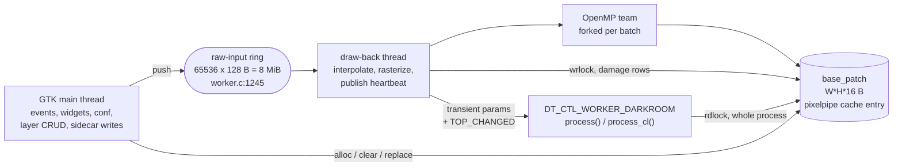
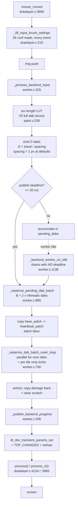

# The drawlayer module

`src/iop/drawlayer.c` plus `src/iop/drawlayer/` is a painting layer: a full-resolution RGBA
canvas per layer, a brush that stamps dabs into it, a sidecar TIFF that stores it, and a
composite into the pipe. This note is the map — what the parts are, which thread owns what,
and where a realtime stroke's time goes. It was written from a full read of the module; every
number below is derived from the code and cites it.

---

## 1. The module is not the directory

`src/iop/CMakeLists.txt:223` compiles **seven** of the eleven `.c` files. The other four —
`conf.c`, `coordinates.c`, `worker.c`, `layers.c` — are text-`#include`d into `drawlayer.c`
(`drawlayer.c:160`, `:161`, `:1558`, `:1563`). The real translation unit is **7130 lines**.

That matters for every reading of this code: a `static` in `worker.c` is in the same namespace
as a `static` in `drawlayer.c`, the directory buys no encapsulation, and the file boundaries
suggest an ownership split that the linker does not enforce. `_commit_dabs` at `worker.c:1157`
resolving to `dt_drawlayer_commit_dabs` in `drawlayer.c` — across what looks like a module
boundary — is only possible because of this.

Actual units, by role:

| file | lines | role |
|---|---|---|
| `drawlayer.c` | 4254 | module API, GUI, the whole OpenCL composite, `process`/`process_cl` |
| `worker.c` | 1665 | the `draw-back` thread, the ring, batching, the heartbeat |
| `io.c` | 1151 | sidecar TIFF read/write |
| `runtime.c` | 1001 | the event→schedule→action dispatcher |
| `paint.c` | 981 | pointer samples → dabs (interpolation, spacing, smoothing) |
| `brush.c` | 913 | the per-pixel rasterizer |
| `widgets.c` | 860 | widget construction helpers |
| `cache.c` | 642 | patch allocation over the pixelpipe cache arena |
| `layers.c` | 484 | layer CRUD, the GUI-side canvas loader |
| `conf.c` | 370 | preferences |
| `coordinates.c` | 357 | coordinate spaces |

---

## 2. Four threads, and what each may touch

**Ownership is not clean, and that is the module's central defect.** The same `base_patch` is
written by the worker (`worker.c:961-970`), read by the pipeline across a whole `process()`
(rdlock `drawlayer.c:1621` → released `runtime.c:975` via `:4238`/`:4117`), and replaced by the
GUI (`layers.c:199-213`). The entry's rwlock guards the *pixels*; nothing guards the *patch
struct* that holds the lock.

Three things cross a thread boundary they should not:

- **`self->params` is written by the worker thread.** `_publish_backend_progress`
  (`worker.c:302-320`) does a read-modify-write of the params blob to bump
  `stroke_commit_hash`, then hands it to `dt_dev_transient_params_set`. The transient channel
  is the sanctioned route (CLAUDE.md); mutating `self->params` to feed it is not — the GUI
  thread writes the same blob from `_widget_changed` with no lock in common.
- **`cache_dirty_rect` has no synchronisation at all.** Written by the worker
  (`worker.c:364`, `:973`), read *and reset* by the pipeline (`drawlayer.c:741`, `:746`,
  `:952`). Plain 20-byte struct, no mutex, no atomic, no barrier.
- **The pipeline writes `self->params` and opens the sidecar.** `PROCESS_*_BEFORE` schedules
  `ensure_layer_cache` (`runtime.c:641-647`), which begins by `_sanitize_params` on
  `self->params` from the pipeline thread (`layers.c:136`).

---

## 3. A live stroke, end to end

### The cost model

With `r` = brush radius (conf default **64**, `conf.c:78`), `s` = spacing
(`1 + distance/100 * (2r-1)`, `paint.c:64`; `distance` default **0** ⇒ **s = 1 px**), `T` =
`omp_get_max_threads()`, `B = 2T` dabs per batch (`worker.c:898`):

- dab footprint `A = (2r+2)² = 16 900 px`, of which `πr² = 12 868` are inside the disc;
- **overdraw = 2r/s = 128** — every stroke pixel is composited 128 times;
- per batch at `T=16`: `32 × 12 868 = 411 776` full RGBA read-modify-writes.

---

## 4. How the rasterizer works, and what it used to cost

A stroke pixel used to be composited about 128 times. It is now composited **once per
batch**, and the reason is algebra rather than tuning.

With the stroke mask present and the internal flow at 0 (UI Flow 100%, the default), the
per-pixel alpha is `capped = min(ba, (cap − s)/(1 − s))` with the mask update
`s' = 1 − (1 − capped)(1 − s)`. Both branches of that min collapse into one closed form —

> **s' = min( 1 − (1 − ba)(1 − s),  cap )**

because the cap is *absorbing*: once it binds, every later dab leaves `s` at `cap`. Over a
batch that composes to

> **s_final = min( 1 − Πᵢ (1 − baᵢ) · (1 − s₀),  cap )**

a product of per-dab transmittance factors, clamped once. So `dt_drawlayer_brush_rasterize_batch`
(`brush.c`) runs two passes: pass 1 accumulates `T ·= (1 − ba)` into a scalar plane — four
bytes per pixel, no destination load, no `powf` — and pass 2 walks the batch box once and
does a single float4 composite.

Three properties of that, in order of how easy they are to lose:

- **Transmittance, not coverage.** `T ·= (1 − ba)` reproduces the existing sequence of
  operations. The algebraically identical `A = 1 − (1 − A)(1 − ba)` would drift, because
  `1 − (1 − x)` is not exact in binary floating point. Measured against the per-dab path
  across dense, cap-binding, sparse and ERASE cases: **1.192e-07**, one ULP at 1.0 in float32.
- **The product is commutative, so order stops mattering** — which is what lets both passes
  run over disjoint rows with no locks at all, and makes the result bit-identical between one
  thread and many. The scheme it replaced used an `omp_lock_t` per 128 px tile, which gave
  mutual exclusion but never *ordering*; since the per-pixel alpha depends on the running
  stroke alpha, that path produced a different picture run to run.
- **The derivation is gated, because it is conditional.** `dt_drawlayer_brush_batch_is_uniform`
  requires one mode (PAINT or ERASE), one opacity, one colour and Flow at 100%. SMUDGE and
  BLUR never qualify — they read the destination per dab. Everything refused falls through to
  the per-dab loop unchanged.

`tests/unittests/test_drawlayer_batch_raster.c` pins all of this, including the gate's
refusals and the thread-count independence.

**Measured, one heartbeat batch at the defaults** (r=64, spacing 1, 32 dabs, 8 cores):

| | per-dab | batch |
|---|---|---|
| plain | 21.0 ms | 1.6 ms |
| sprinkles 0.6 | 131.9 ms | 3.3 ms |

The old figures are the interesting ones. A plain stroke was *above* the 20 ms heartbeat
budget, so the rasterizer alone could not keep up with its own publish rate; a textured one
was **6.6× over it**, which is what "the brush lags" means in practice.

### What the per-pixel loop no longer does

Three things used to sit in it and no longer do.

- **A `powf`**, feeding `accum_alpha`, which `_lerpf(·, ·, 0)` discarded at the default Flow.
- **Four per-dab constants recomputed per pixel** — `hardness`, `min_inner`, `inner` and the
  transition width — inside `dt_drawlayer_brush_profile_eval`.
  `dt_drawlayer_brush_profile_prepare` resolves them once per dab onto the runtime view and
  `..._eval_fast` performs the identical arithmetic on the identical operands, so the floats
  are unchanged. Worth ~20% of the per-dab path and ~2× of the batch path.
- **The sprinkle field, evaluated per dab per pixel.** `_cellular_grain_2d` is 9 cells × 4
  `splitmix32` per octave, up to three octaves — **up to 108 hashes per pixel** — and it is a
  function of *layer* position and the stroke seed alone, so every overlapping dab sampled the
  same value. The batch now evaluates it once over the batch box, which divides it by the
  overdraw factor; the per-dab `alpha_noise_gain` stays per dab. That is what the uniformity
  gate's sprinkle-parameter checks are for.

What remains per pixel is a `sqrtf`, a shape `switch`, and the transmittance multiply.

## 5. Where else the time goes

Fixed:

- The 26 `dt_conf_get_*` per pointer motion are now one resolve per *change*
  (`_refresh_brush_settings_cache`). `dt_conf_get_float` runs `dt_calculator_solve` — an
  expression parser — on the stored string at every call.
- The 32-point radial quadrature (32 `asinf`, 32 `sqrtf`, ~96 divisions) is memoised on
  (radius, hardness, shape, spacing); with no tablet map on size or softness it is computed
  once per stroke.
- `dab->wx`/`wy` and the `dev->geometry_chain` walk that filled them from the worker thread
  are deleted — four writers, no readers.
- The drain loop honours the same 20 ms publish deadline as the input path. It used to
  publish after every batch: a transient-params write, a `TOP_CHANGED` flag and an
  asynchronous signal raise apiece.
- Two unconditional `dt_get_wtime()` per dab now happen only when the trace is on.

Not fixed:

- **The batch bounding box is still computed twice**, in two different coordinate frames:
  `_collect_batch_bounds` works against the full canvas, the inner pass against the
  heartbeat patch. Deduplicating means translating between them.
- **`process()` composites the whole `roi_out` every frame** and never consults
  `cache_dirty_rect`, while `process_cl()` does. The win is smaller than it looks:
  `dt_interpolation_resample` takes a 1:1 fast path (`interpolation.c:920-937`, reached
  because `source_roi.scale` is hardcoded to 1.0f) at the zoom levels people paint at, so
  only the alpha-over blend is full-frame there. It is worth most when zoomed *out*. A
  damage-limited CPU composite also cannot copy the GPU gate: that one depends on the output
  cacheline being rekeyed in place, which `cache_output_on_ram` prevents on the CPU path.
- **Per layer create: two complete sidecar rewrites** (`drawlayer.c`) — on a 6000×4000 canvas
  with 3 layers, ~1.15 GB of half-float traffic through zlib, twice, on the GUI thread.
  `io.c` takes no lock anywhere and uses a fixed `<path>.tmp` name while being reachable from
  three threads.

## 6. State is ten booleans, not a state machine

The logical state — idle / hovering / painting / draining / committing / loading / saving —
is spread across at least ten independent booleans in five structs (`runtime.h:19`, `:43-45`,
`:68`, `:76`, `:79`, `:228-230`) plus a 15-boolean schedule, with no enum and no asserted
invariant. `realtime_active` is a stored copy of a pure function of three of them.

`_build_runtime_schedule` (`runtime.c:411`) maps an event to that 15-boolean schedule; the
dispatcher then executes the set bits. It recomputes its whole state twice per dispatch and
pushes realtime mode twice.

---

## 7. Dead weight

Confirmed by whole-tree grep, not by inspection:

- `dt_drawlayer_runtime_host_t.collect_inputs` / `.perform_action` are **never dereferenced**;
  `drawlayer.c:135-136` `#define`s both to `NULL` and assigns them at **19 sites** (~250 lines).
- **389 of `cache.c`'s 642 lines** are a second "process patch" cache tier with no callers
  outside the file.
- **Nine exported functions** have no caller anywhere (`worker.c:1592`, `:1630`, `:1636`,
  `:1641`, `paint.c:847`, `:877`, `widgets.c:386`, `io.c:972`, `drawlayer.c:2662`).
- `dt_drawlayer_brush_dab_t.wx`/`.wy`: written at three sites, read at none.
- `drawlayer_process_scratch_t.flush_update_rgba`: declared and freed, never allocated or read.
- `direct_copy` has exactly one assignment, `FALSE`, so its fast path is dead in both backends.
- `_blend_layer_over_input_cl` takes **19 parameters** for one call site, three of which are
  provably constant there.
- `gui_init` is **334 lines** of stereotyped widget quartets; the 3×4 tablet-mapping grid at
  `:3131` is already table-driven and proves the rest could be.

---

## 8. Two hazards that were not performance

Both fixed; recorded because the shapes recur.

**The worker could deadlock itself and take the GUI down with it.**
`_backend_worker_on_idle` called `_commit_dabs` → `_wait_worker_idle`, which blocks while
`ring_count > 0` — and the ring's only consumer is the worker's own loop. It read the
"ready" predicate under the mutex, dropped it, then committed, so a GUI push in that window
made the wait real. The only escape, `worker->stop`, is written by `_stop_worker` *after* it
calls `_wait_worker_idle` too, so the next GUI-side commit hung the GUI thread on the same
predicate. The worker now posts the commit to the GUI thread and decides-and-posts under one
lock acquisition; `_wait_worker_idle` carries a tripwire. Note the cheap fix — making the
wait a no-op on the worker thread — is *wrong*: at that point the ring may hold a new
stroke's events, and the commit would wipe that stroke's session state.

**A never-cleared arena page was published as a valid canvas.**
`dt_drawlayer_cache_patch_alloc_shared` allocates but does not clear, and
`_refresh_piece_base_cache` set `cache_valid = TRUE` without clearing when it never attempted
a load. The GUI-side twin had always cleared; the two loaders had diverged. Both key the same
cache entry, so an uncleared page created by the pipeline is adopted by the GUI as the
layer's content and a later sidecar write makes it permanent. The clear stays at the call
site: moving it into the allocator would add a dead full-canvas memset on the rekey-conflict
path, which memcpys the whole buffer on its next statement.

Three more of the same family, also fixed: the worker wrote `self->params` (it now carries
its own blob, *seeded* from the GUI thread, because the hash is an accumulator); the damage
rectangle was published after releasing the write lock that wrote the pixels it describes;
and `dt_dev_pixelpipe_t.pause` was a plain `gboolean` written cross-thread beside three
fields that are atomics for exactly that reason.

Still open: the **pipeline thread writes `self->params` and opens the sidecar** —
`PROCESS_*_BEFORE` schedules `ensure_layer_cache`, whose first act is `_sanitize_params` on
`self->params`. Removing it is not a deletion: `g->process.cache_valid = TRUE` happens in
exactly one place, inside that function, so a display pipe would never composite the layer
again without a GUI-thread request path to replace it.

## 9. "Move the rasterizer to the GPU" — the verdict

No, not as the next step, and the reasoning is not about kernel speed. The dab stream is
produced by pointer events on the GUI thread; CLAUDE.md's *OpenCL GUI-thread materialization
hazard* forbids the GUI thread enqueueing work on a device it does not own; the canvas would
then live on the device and the CPU-side base patch would need syncing for every `process()`,
export and sidecar write; and the current split already keeps a 384 MB canvas resident in vRAM
per layer. The CPU rasterizer has a **~26× algorithmic factor and a ~16× parallelism factor**
still on the table (§4). Spend those first; they cost no new synchronisation and no vRAM.
