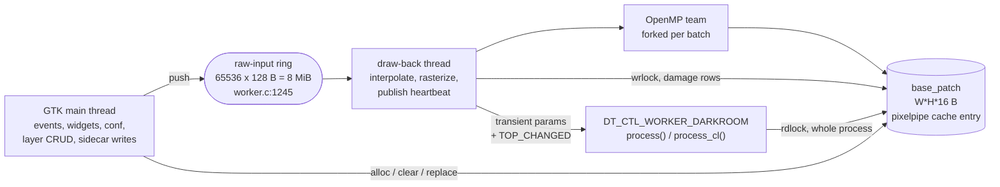
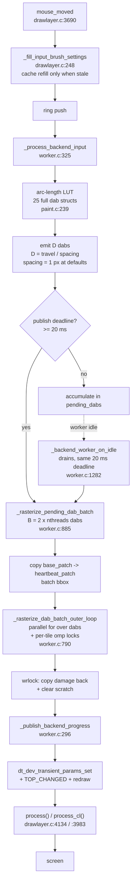

# The drawlayer module

> **Verified against `f37105c227` on 2026-09-29.** That pass found 9 claim(s) in this file
> that were wrong of the tree and 17 that had gone stale; the ones corrected since carry a note
> saying what they used to say. Anything not yet corrected is flagged inline. Re-measure before
> acting on a claim older than the code you are changing, and re-date this line when you do.

`src/iop/drawlayer.c` plus `src/iop/drawlayer/` is a painting layer: a full-resolution RGBA
canvas per layer, a brush that stamps dabs into it, a sidecar TIFF that stores it, and a
composite into the pipe. This note is the map — what the parts are, which thread owns what,
and where a realtime stroke's time goes. It was written from a full read of the module; every
number below is derived from the code and cites it.

**Re-verified against the tree on 2026-09-29, after #1418, #1430, #1431 and #1471, and
corrected again the same day against `1cfa1551c8`.** The second pass found six claims still
wrong — two of them describing defects the refactor had already *fixed*, which is the worse
direction: §2's `self->params` finding and §7's dead-function list. Citations drift as the code
moves, and this note has now shipped a finding that named the wrong struct, one whose count was
stale, and two that survived their own repair — so re-measure before acting on any claim, and
say so here when you do.

A mechanical check worth re-running: every `file.ext:NNN` in this document should resolve to a
line that exists. All of them do as of `1cfa1551c8` — but note a **bare** `:NNN`, continuing a
previous citation, is invisible to that check and is how `drawlayer.c:4238` survived in §2 for a
file of 4169 lines. Write the filename out. Sections 1, 6 and 7 carry a note
where their earlier version was wrong rather than being quietly corrected, because the *way*
each was wrong is the more useful thing to know.

---

## 1. Eleven translation units, one per file

*This section used to be titled "the module is not the directory" and described four files
text-`#include`d into `drawlayer.c`. #1431 removed that; the numbers below are 2026-09-29.*

`src/iop/CMakeLists.txt` compiles **all eleven** `.c` files. There is no `#include` of a `.c`
anywhere in the module, so a `static` really is private to its file and the directory buys the
encapsulation its layout suggests.

What that cost, and why it is worth keeping: as one unit the module was 7130 lines, a `static`
in `worker.c` shared a namespace with one in `drawlayer.c`, and ten alias macros existed so
pasted code could call a public function by a private-looking name (`_commit_dabs` for
`dt_drawlayer_commit_dabs`). Compiled alone the four spliced files raised 819 errors, every one
a header they had been borrowing from their host without naming it. Three headers could not be
included first either: `coordinates.h` declared twelve functions over `dt_iop_module_t`,
`dt_iop_roi_t` and `dt_drawlayer_brush_dab_t` and included **nothing**; `worker.h` named types
it never pulled in; `runtime.h` held a `dt_drawlayer_cache_patch_t` by value without
`cache.h`.

Actual units, by role:

| file | lines | role |
|---|---|---|
| `drawlayer.c` | 4169 | module API, GUI, the whole OpenCL composite, `process`/`process_cl` |
| `worker.c` | 1828 | the `draw-back` thread, the ring, batching, the heartbeat |
| `brush.c` | 1196 | the per-pixel rasterizer |
| `io.c` | 1101 | sidecar TIFF read/write |
| `paint.c` | 994 | pointer samples → dabs (interpolation, spacing, smoothing) |
| `runtime.c` | 973 | the event→schedule→action dispatcher |
| `widgets.c` | 851 | widget construction helpers |
| `layers.c` | 489 | layer CRUD, the GUI-side canvas loader |
| `conf.c` | 375 | preferences, and the tablet-mapping widget↔key pairing |
| `coordinates.c` | 366 | coordinate spaces |
| `cache.c` | 246 | patch allocation over the pixelpipe cache arena |

---

## 2. Four threads, and what each may touch

```mermaid
flowchart LR
  GUI["GTK main thread<br/>events, widgets, conf,<br/>layer CRUD, sidecar writes"]
  RING(["raw-input ring<br/>65536 x 128 B = 8 MiB<br/>worker.c:1245"])
  WK["draw-back thread<br/>interpolate, rasterize,<br/>publish heartbeat"]
  OMP["OpenMP team<br/>forked per batch"]
  PIPE["DT_CTL_WORKER_DARKROOM<br/>process() / process_cl()"]
  CANVAS[("base_patch<br/>W*H*16 B<br/>pixelpipe cache entry")]

  GUI -->|push| RING --> WK
  WK --> OMP --> CANVAS
  WK -->|wrlock, damage rows| CANVAS
  PIPE -->|rdlock, whole process| CANVAS
  WK -->|transient params<br/>+ TOP_CHANGED| PIPE
  GUI -->|alloc / clear / replace| CANVAS
```

**Ownership is not clean, and that is the module's central defect.** The same `base_patch` is
written by the worker (`worker.c:961-970`), read by the pipeline across a whole `process()`
(rdlock `drawlayer.c:1621`, released through the `dt_drawlayer_runtime_release_t` set at
`drawlayer.c:4049`, `:4129` and `:4149`), and replaced by the GUI (`layers.c:199-213`). The
entry's rwlock guards the *pixels*; nothing guards the *patch struct* that holds the lock.

Two things cross a thread boundary they should not:

- ~~**`self->params` is written by the worker thread.**~~ **Corrected 2026-09-29: it is not,
  and has not been since the realtime rework.** `_publish_backend_progress` reads
  `&ctx->worker->publish_params` (`worker.c:326`) — a worker-private blob declared at
  `worker.c:118`, seeded from `self->params` by the GUI thread at stroke begin
  (`dt_drawlayer_worker_snapshot_params`) and owned by the worker thereafter. Its own doc
  comment states the rule this finding was written about: "The heartbeat must never touch
  `self->params`: that blob belongs to the GUI thread." The finding is kept, struck through,
  because the *shape* is right and recurs — feeding the transient channel by mutating the
  module's live params is not the sanctioned route — but the module does not do it. The GUI
  thread writes the same blob from `_widget_changed` with no lock in common.
- **`cache_dirty_rect` has no synchronisation at all.** Written by the worker
  (`worker.c:364`, `:973`), read *and reset* by the pipeline (`drawlayer.c:741`, `:746`,
  `:952`). Plain 20-byte struct, no mutex, no atomic, no barrier.
- **The pipeline writes `self->params` and opens the sidecar.** `PROCESS_*_BEFORE` schedules
  `ensure_layer_cache` (`runtime.c:641-647`), which begins by `_sanitize_params` on
  `self->params` from the pipeline thread (`layers.c:136`).

---

## 3. A live stroke, end to end

> Two labels in this diagram were corrected on 2026-09-29. The **26 conf reads per event** were
> real when first measured but are not what `_fill_input_brush_settings` does: they live in
> `_refresh_brush_settings_cache` (`drawlayer.c:206-247`), which the filler calls at
> `drawlayer.c:252` only when `g->ui.brush_settings_valid` is false. And the drain loop has
> honoured the input path's publish deadline since `worker.c:1282` — the "Fixed" list in §4 says
> so, and the diagram was still showing the state before it.

```mermaid
flowchart TD
  M["mouse_moved<br/>drawlayer.c:3690"] --> BRS["_fill_input_brush_settings<br/>drawlayer.c:248<br/>cache refill only when stale"]
  BRS --> PUSH["ring push"]
  PUSH --> PBI["_process_backend_input<br/>worker.c:325"]
  PBI --> LUT["arc-length LUT<br/>25 full dab structs<br/>paint.c:239"]
  LUT --> EMIT["emit D dabs<br/>D = travel / spacing<br/>spacing = 1 px at defaults"]
  EMIT --> Q{"publish deadline?<br/>>= 20 ms"}
  Q -->|no| WAIT["accumulate in pending_dabs"]
  Q -->|yes| BATCH
  WAIT -.->|worker idle| DRAIN["_backend_worker_on_idle<br/>drains, same 20 ms deadline<br/>worker.c:1282"]
  DRAIN --> BATCH
  BATCH["_rasterize_pending_dab_batch<br/>B = 2 x nthreads dabs<br/>worker.c:885"]
  BATCH --> CP1["copy base_patch -> heartbeat_patch<br/>batch bbox"]
  CP1 --> RAST["_rasterize_dab_batch_outer_loop<br/>parallel for over dabs<br/>+ per-tile omp locks<br/>worker.c:790"]
  RAST --> CP2["wrlock: copy damage back<br/>+ clear scratch"]
  CP2 --> PUB["_publish_backend_progress<br/>worker.c:296"]
  PUB --> TP["dt_dev_transient_params_set<br/>+ TOP_CHANGED + redraw"]
  TP --> PROC["process() / process_cl()<br/>drawlayer.c:4134 / :3983"]
  PROC --> SCREEN["screen"]
```

### The cost model

With `r` = brush radius (conf default **64**, `conf.c:78`), `s` = spacing
(`1 + distance/100 * (2r-1)`, `paint.c:64`; `distance` default **0** ⇒ **s = 1 px**), `T` =
`omp_get_max_threads()`, `B = 2T` dabs per batch (`worker.c:898`):

- dab footprint `A = (2r+2)² = 16 900 px`, of which `πr² = 12 868` are inside the disc;
- **overdraw = 2r/s = 128** — every stroke pixel is composited 128 times;
- per batch at `T=16`: `32 × 12 868 = 411 776` full RGBA read-modify-writes.

---

## 4. How the rasterizer works, and what it used to cost

A stroke pixel used to be composited about 128 times. It is now composited **once per
batch**, and the reason is algebra rather than tuning.

With the stroke mask present and the internal flow at 0 (UI Flow 100%, the default), the
per-pixel alpha is `capped = min(ba, (cap − s)/(1 − s))` with the mask update
`s' = 1 − (1 − capped)(1 − s)`. Both branches of that min collapse into one closed form —

> **s' = min( 1 − (1 − ba)(1 − s),  cap )**

because the cap is *absorbing*: once it binds, every later dab leaves `s` at `cap`. Over a
batch that composes to

> **s_final = min( 1 − Πᵢ (1 − baᵢ) · (1 − s₀),  cap )**

a product of per-dab transmittance factors, clamped once. So `dt_drawlayer_brush_rasterize_batch`
(`brush.c`) runs two passes: pass 1 accumulates `T ·= (1 − ba)` into a scalar plane — four
bytes per pixel, no destination load, no `powf` — and pass 2 walks the batch box once and
does a single float4 composite.

Three properties of that, in order of how easy they are to lose:

- **Transmittance, not coverage.** `T ·= (1 − ba)` reproduces the existing sequence of
  operations. The algebraically identical `A = 1 − (1 − A)(1 − ba)` would drift, because
  `1 − (1 − x)` is not exact in binary floating point. Measured against the per-dab path
  across dense, cap-binding, sparse and ERASE cases: **1.192e-07**, one ULP at 1.0 in float32.
- **The product is commutative, so order stops mattering** — which is what lets both passes
  run over disjoint rows with no locks at all, and makes the result bit-identical between one
  thread and many. The scheme it replaced used an `omp_lock_t` per 128 px tile, which gave
  mutual exclusion but never *ordering*; since the per-pixel alpha depends on the running
  stroke alpha, that path produced a different picture run to run.
- **The derivation is gated, because it is conditional.** `dt_drawlayer_brush_batch_is_uniform`
  requires one mode (PAINT or ERASE), one opacity, one colour and Flow at 100%. SMUDGE and
  BLUR never qualify — they read the destination per dab. Everything refused falls through to
  the per-dab loop unchanged.

`tests/unittests/test_drawlayer_batch_raster.c` pins all of this, including the gate's
refusals and the thread-count independence.

**Measured, one heartbeat batch at the defaults** (r=64, spacing 1, 32 dabs, 8 cores):

| | per-dab | batch |
|---|---|---|
| plain | 21.0 ms | 1.6 ms |
| sprinkles 0.6 | 131.9 ms | 3.3 ms |

The old figures are the interesting ones. A plain stroke was *above* the 20 ms heartbeat
budget, so the rasterizer alone could not keep up with its own publish rate; a textured one
was **6.6× over it**, which is what "the brush lags" means in practice.

### What the per-pixel loop no longer does

Three things used to sit in it and no longer do.

- **A `powf`**, feeding `accum_alpha`, which `_lerpf(·, ·, 0)` discarded at the default Flow.
- **Four per-dab constants recomputed per pixel** — `hardness`, `min_inner`, `inner` and the
  transition width — inside `dt_drawlayer_brush_profile_eval`.
  `dt_drawlayer_brush_profile_prepare` resolves them once per dab onto the runtime view and
  `..._eval_fast` performs the identical arithmetic on the identical operands, so the floats
  are unchanged. Worth ~20% of the per-dab path and ~2× of the batch path.
- **The sprinkle field, evaluated per dab per pixel.** `_cellular_grain_2d` is 9 cells × 4
  `splitmix32` per octave, up to three octaves — **up to 108 hashes per pixel** — and it is a
  function of *layer* position and the stroke seed alone, so every overlapping dab sampled the
  same value. The batch now evaluates it once over the batch box, which divides it by the
  overdraw factor; the per-dab `alpha_noise_gain` stays per dab. That is what the uniformity
  gate's sprinkle-parameter checks are for.

What remains per pixel is a `sqrtf`, a shape `switch`, and the transmittance multiply.

## 5. Where else the time goes

Fixed:

- The 26 `dt_conf_get_*` per pointer motion are now one resolve per *change*
  (`_refresh_brush_settings_cache`). `dt_conf_get_float` runs `dt_calculator_solve` — an
  expression parser — on the stored string at every call.
- The 32-point radial quadrature (32 `asinf`, 32 `sqrtf`, ~96 divisions) is memoised on
  (radius, hardness, shape, spacing); with no tablet map on size or softness it is computed
  once per stroke.
- The `dev->geometry_chain` walk that ran from the worker thread is deleted. (`wx`/`wy`
  themselves are **not** deleted and were never on `dt_drawlayer_brush_dab_t`: they are the
  pointer's widget coordinates on `dt_drawlayer_paint_raw_input_t` (`paint.h:51-52`), read at
  `worker.c:192` and in `drawlayer.c`. What went was the worker-side geometry walk that used
  to translate them.)
- The drain loop honours the same 20 ms publish deadline as the input path. It used to
  publish after every batch: a transient-params write, a `TOP_CHANGED` flag and an
  asynchronous signal raise apiece.
- Two unconditional `dt_get_wtime()` per dab now happen only when the trace is on.

Not fixed:

- **The batch bounding box is still computed twice**, in two different coordinate frames:
  `_collect_batch_bounds` works against the full canvas, the inner pass against the
  heartbeat patch. Deduplicating means translating between them.
- **`process()` composites the whole `roi_out` every frame** and never consults
  `cache_dirty_rect`, while `process_cl()` does. The win is smaller than it looks:
  `dt_interpolation_resample` takes a 1:1 fast path (`pixel/interpolation.c:946`) at the zoom
  levels people paint at, so
  only the alpha-over blend is full-frame there. It is worth most when zoomed *out*. A
  damage-limited CPU composite also cannot copy the GPU gate: that one depends on the output
  cacheline being rekeyed in place, which `cache_output_on_ram` prevents on the CPU path.
- **Per layer create: two complete sidecar rewrites** (`drawlayer.c`) — on a 6000×4000 canvas
  with 3 layers, ~1.15 GB of half-float traffic through zlib, twice, on the GUI thread.
  `io.c` takes no lock anywhere and uses a fixed `<path>.tmp` name while being reachable from
  three threads.

## 6. State is twelve booleans, not a state machine

*Re-measured 2026-09-29; the line numbers below are current, the previous ones had drifted
off their targets entirely. Check them before quoting them — this section has been wrong once.*

The logical state — idle / hovering / painting / draining / committing / loading / saving —
is spread across **twelve** independent booleans in five structs, with no enum and no asserted
invariant:

| struct | booleans | `runtime.h` |
| --- | --- | --- |
| `dt_drawlayer_session_state_t` | `pointer_valid`, `background_job_running` | `:20`, `:30` |
| `dt_drawlayer_process_state_t` | `cache_valid`, `cache_dirty`, `base_patch_loaded_ref`, `last_composite_valid` | `:44`, `:45`, `:51`, `:69` |
| `dt_drawlayer_stroke_state_t` | `last_dab_valid`, `finish_commit_pending` | `:77`, `:80` |
| `dt_drawlayer_ui_state_t` | `brush_color_valid`, `brush_settings_valid` | `:124`, `:126` |
| `dt_drawlayer_runtime_manager_t` | `realtime_active`, `painting_active` | `:255`, `:256` |

Beside them sits a 15-boolean schedule, `dt_drawlayer_runtime_schedule_t` — declared in
`runtime.c`, not the header. `_build_runtime_schedule` (`runtime.c:462`) maps an event onto
it and the dispatcher executes the set bits. It recomputes its whole state twice per dispatch
and pushes realtime mode twice.

**`realtime_active` is NOT a cached pure function**, which an earlier version of this section
claimed. It is computed from three inputs (`runtime.c:345`), then *overridden* to FALSE for
four event kinds (`:356`), and written FALSE again from two commit-time sites outside that
computation (`drawlayer.c:1878`, `:1894`). Replacing it with a predicate would lose both
overrides. Note the pairing at those two sites — the flag and
`dt_drawlayer_set_pipeline_realtime_mode(self, FALSE)` are set together, while four other
places derive the pipeline mode *from* the flag (`runtime.c:434`, `:443`, `:679`, `:880`).
Two spellings of one operation, and the shape this module keeps paying for.

`brush_color_valid` deserves its own warning: it is set TRUE once (`drawlayer.c`, in
`dt_drawlayer_sync_cached_brush_colors`) and **never cleared anywhere**. Nothing rebuilds the
cached brush colours lazily, so every path that changes what they depend on must refresh them
explicitly. Until #1471 the refresh happened only because refilling the HDR exposure slider
woke `_widget_changed` on the panel paths that were not frozen — an accident the frozen path
never had.

---

## 7. Dead weight

*Drained across #1430, #1431 and #1471. What is left is at the bottom; the rest is kept as a
record, because two of the original entries were WRONG and the way they were wrong is worth
knowing.*

**Removed:**

- `dt_drawlayer_runtime_host_t.collect_inputs` / `.perform_action`, never dereferenced,
  assigned at 19 sites (#1430). `runtime.h` keeps a comment where they were.
- 389 of `cache.c`'s 642 lines — a second "process patch" cache tier with no caller outside
  the file (#1430).
- Three of the nine uncalled exported functions (#1430).
- `drawlayer_process_scratch_t.flush_update_rgba`: a pointer, a size beside it and a free.
  Nothing ever allocated it, so nothing read it and the free was on NULL (#1471).
- `direct_copy`: one assignment in the whole tree, `FALSE`. The GPU fast branch was
  unreachable, the `!direct_copy` term in the partial-composite predicate always true, and
  the CPU path's `if(!source.direct_copy)` wrapped 25 lines that always ran (#1471).
- `_blend_layer_over_input_cl`'s constant arguments, then its parameter list (#1471). See the
  correction below.
- `gui_init`'s 332 lines, now 72, split into three tab builders that each connect their own
  widgets (#1471). The 3×4 tablet-mapping grid it was already table-driven for is now ONE
  list — `dt_drawlayer_mapping_rows()` — walked by the builder, by `gui_update` and by
  `sync_params_from_gui`, where each used to spell it out.
- The runtime manager's `background_job_running`, written twice and read never. The
  *session*'s identically-named field is the live one, which is why this survived: a grep for
  the name finds eleven uses and looks busy (#1471).
- Three `fill_*` widgets that had exactly create/pack/connect, whose handlers ignore the
  button they are given (#1471).

**Two entries in this list were wrong. Verify before acting on any of the rest.**

- `dt_drawlayer_brush_dab_t.wx`/`.wy` "written at three sites, read at none" named **the wrong
  struct**. The dab type has no such fields. The writes are to
  `dt_drawlayer_paint_raw_input_t`, and they ARE read — `paint.c` quantises them into the dab
  hash, and `worker.c` and `drawlayer.c` convert them to layer coordinates. Acting on this
  entry would have deleted the pointer coordinates that place every dab.
- `_blend_layer_over_input_cl` "takes 19 parameters, three provably constant" was 16 and two
  by the time anyone reached it, because `direct_copy` was the third and had already gone.
  Both remaining constants gated real code: `force_device_copy` selected an eager
  `dt_opencl_copy_host_to_device()`, and `source_mem_override` had a branch plus **four**
  guards written to work whether or not it was set. It now takes one named
  `drawlayer_blend_cl_request_t`.

**Still open:**

- ~~**Six exported functions have no caller anywhere**~~ — **three**, re-measured
  2026-09-29: `dt_drawlayer_io_background_layer_job_run`,
  `dt_drawlayer_paint_runtime_get_stroke_seed`, `dt_drawlayer_worker_raw_inputs`. The other
  three on the original list gained callers when the TU splice was undone and they stopped
  being reachable by private name: `dt_drawlayer_brush_transition_mass_primitive_eval`
  (`brush_profile.h:210`), `dt_drawlayer_brush_profile_prepare` (`brush.c:290`),
  `dt_drawlayer_brush_mass_primitive_eval` (`paint.c`). That is the splice's signature one last
  time — a "dead" export that was live all along, invisible because the caller and the callee
  shared a namespace.

---

## 8. Two hazards that were not performance

Both fixed; recorded because the shapes recur.

**The worker could deadlock itself and take the GUI down with it.**
`_backend_worker_on_idle` called `dt_drawlayer_commit_dabs` (`worker.c:1234`) →
`dt_drawlayer_worker_wait_idle` (`worker.c:1415`) — the private-looking spellings `_commit_dabs`
and `_wait_worker_idle` are from the splice era and exist nowhere in the tree — which blocks
while
`ring_count > 0` — and the ring's only consumer is the worker's own loop. It read the
"ready" predicate under the mutex, dropped it, then committed, so a GUI push in that window
made the wait real. The only escape, `worker->stop`, is written by `_stop_worker` *after* it
calls `_wait_worker_idle` too, so the next GUI-side commit hung the GUI thread on the same
predicate. The worker now posts the commit to the GUI thread and decides-and-posts under one
lock acquisition; `dt_drawlayer_worker_wait_idle` carries a tripwire. Note the cheap fix — making the
wait a no-op on the worker thread — is *wrong*: at that point the ring may hold a new
stroke's events, and the commit would wipe that stroke's session state.

**A never-cleared arena page was published as a valid canvas.**
`dt_drawlayer_cache_patch_alloc_shared` allocates but does not clear, and
`_refresh_piece_base_cache` set `cache_valid = TRUE` without clearing when it never attempted
a load. The GUI-side twin had always cleared; the two loaders had diverged. Both key the same
cache entry, so an uncleared page created by the pipeline is adopted by the GUI as the
layer's content and a later sidecar write makes it permanent. The clear stays at the call
site: moving it into the allocator would add a dead full-canvas memset on the rekey-conflict
path, which memcpys the whole buffer on its next statement.

Three more of the same family, also fixed: the worker wrote `self->params` (it now carries
its own blob, *seeded* from the GUI thread, because the hash is an accumulator); the damage
rectangle was published after releasing the write lock that wrote the pixels it describes;
and `dt_dev_pixelpipe_t.pause` was a plain `gboolean` written cross-thread beside three
fields that are atomics for exactly that reason.

Still open: the **pipeline thread writes `self->params` and opens the sidecar** —
`PROCESS_*_BEFORE` schedules `ensure_layer_cache`, whose first act is `_sanitize_params` on
`self->params`. Removing it is not a deletion: `g->process.cache_valid = TRUE` happens in
exactly one place, inside that function, so a display pipe would never composite the layer
again without a GUI-thread request path to replace it.

## 9. "Move the rasterizer to the GPU" — the verdict

No, not as the next step, and the reasoning is not about kernel speed. The dab stream is
produced by pointer events on the GUI thread; CLAUDE.md's *OpenCL GUI-thread materialization
hazard* forbids the GUI thread enqueueing work on a device it does not own; the canvas would
then live on the device and the CPU-side base patch would need syncing for every `process()`,
export and sidecar write; and the current split already keeps a 384 MB canvas resident in vRAM
per layer. The CPU rasterizer had a **~26× algorithmic factor and a ~16× parallelism factor**
on the table (§4), and **the algorithmic half has since been spent**: `2875569cc8` composites a
stroke pixel once per batch instead of 128 times, and `6b16818e79` hoists the per-pixel
constants the dab and the stroke already fix (both 2026-09-19, i.e. before this document's
2026-09-29 rewrite, which is why the claim read as open when it was not). The parallelism factor
is still there. The argument stands either way: spend what is left on the CPU first, because it
costs no new synchronisation and no vRAM.
