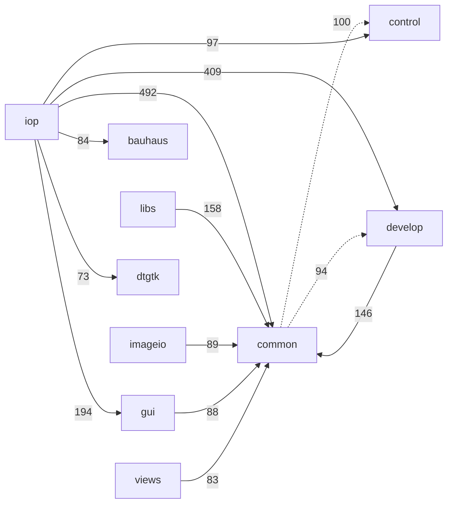
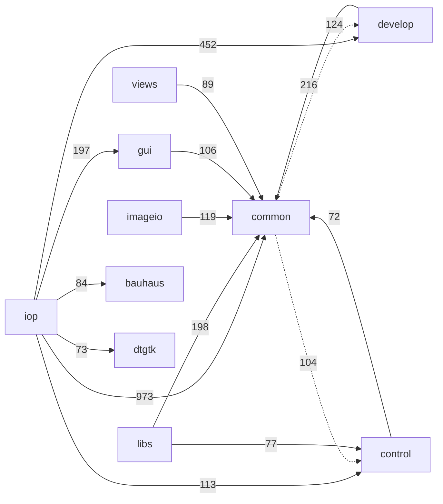

# The include dependency graph: before / after

Measured with `tools/include_graph.py` (static analysis of `#include "..."` edges under `src/`,
project headers only). Reproduce either side with:

```sh
python3 tools/include_graph.py --summary          # metrics, for before/after diffing
python3 tools/include_graph.py --mermaid          # directory-level graph
python3 tools/include_graph.py                    # cycles, inversions, god-headers, full detail
```

"Before" is `master` at the point this series branched; "after" is the tip of
`refactor/strip-darktable-h`. Both columns are dated measurements taken at those two commits
and are not re-measured, so the paths in them — and in the *before* figures below — are the
ones the tree carried then; the later restructure into `system/`, `pixel/`, `math/`,
`widgets/`, `colorprofiles/` and `apps/` is recorded in `doc/include-hygiene-roadmap.md` §9.
The prose outside the tables and diagrams describes the tree as it stands; re-run the commands
above for today's numbers.

## Headline

| metric | before | after | |
|---|---:|---:|---|
| `cycles` | 3 | **0** | the graph is a DAG |
| `cycle_nodes` | 13 | **0** | |
| `total_transitive_edges` | 30578 | **27999** | −8.4% |
| `mean_closure` (per header) | 19.5 | **13.6** | −30% |
| `tu_median_closure` (headers per TU) | 76 | **65** | −14% |
| `tu_mean_closure_lines` | 16967 | **15355** | −9.5% |
| `darktable_h_reach` | 517 | **17** | −97% |
| `darktable_h_direct_includers` | 343 | **16** | −95% |
| `max_closure` | 84 | **82** | |

`darktable_h_reach` is the number of files that reach `darktable.h` transitively — i.e.
how much of the codebase the application orchestrator is welded to. That is the number this
whole series exists to move.

## Two metrics that look worse and are not

**`direct_edges` 4294 → 5356.** One umbrella include is replaced by the three or four specific
headers a file actually uses. More edges, each of them honest and cheap. This is why the
line-weighted metrics below matter more than the edge count.

**`layering_violations` 331 → 372.** These inversions always existed; `darktable.h` was hiding
them behind a single umbrella edge. When `imageio_module.c` — then in `common/`, now in
`imageio/` — stopped including the orchestrator, it had to say out loud that it calls into
`gui/`. Making them visible is a
precondition for fixing them. The heaviest ones at that measurement (current standings are
in *What is left* below):

| inversion | count |
|---|---:|
| `common/ → develop/` | 124 |
| `common/ → control/` | 104 |
| `common/ → gui/` | 32 |
| `gui/ → develop/` | 28 |

## Why node-counting is the wrong metric, and what replaced it

Counting *nodes* in a transitive closure rewards monoliths. `master`'s `darktable.h` was
a 1277-line header that **defined** its content inline: it counted as **one node dragging in
nine headers**. The same content split into eleven honest headers (`macros.h`, `mem_alloc.h`,
`simd.h`, `openmp.h`, `logging.h`, …) counts as up to eleven — so a naive node metric got
*worse* mid-migration while every individual file was getting cheaper.

`tools/include_graph.py --summary` therefore also reports closure weighed by each header's own
line count (`tu_*_closure_lines`), which is what the preprocessor actually eats. That is the
metric to quote.

## The cycles, and what they had in common

All three had the same root cause: **a trailing "convenience" `#include` at the bottom of a
header**, pulling in a header that includes it right back. `#pragma once` is the only reason
this ever compiled — which is the anti-pattern the `#pragma once` removal is meant to expose.

```
BEFORE (3 SCCs, 13 nodes)

  common/iop_profile.h ─→ develop/imageop.h ─→ common/opencl.h ─┐
         ▲                      │  │                            │
         └──────────────────────┼──┼────────────────────────────┘
                                │  └─→ gui/gui_throttle.h ─┐
                                ▼                          ▼
                    develop/pixelpipe.h ─→ develop/pixelpipe_hb.h
                                ▲                          │
                                └──────────────────────────┘

  control/control.h ⇄ control/jobs.h ⇄ control/jobs/{control,film,image}_jobs.h

  develop/masks.h ⇄ develop/masks/masks_history.h
```

The cuts, each justified by what the header actually needs:

- `develop/pixelpipe.h` no longer trailing-includes `develop/pixelpipe_hb.h`. It is the small
  shared **type** header (pipe type/request enums, histogram params).
- `control/jobs.h` no longer trailing-includes the three `control/jobs/*_jobs.h`. Those needed
  only `dt_job_t`, so they include `control/jobs.h` instead of `control/control.h`.
- `develop/masks/masks_history.h` no longer includes `develop/masks.h` — which must include
  *it* at the bottom, since `dt_masks_form_t` has to be complete first. All five declarations
  take their arguments by pointer, so tag declarations suffice.
- `colorprofiles/iop_profile.h` (`common/iop_profile.h` in the diagram above) no longer includes
  `develop/imageop.h`: every type it used was already tag-declared and used only through a
  pointer. That edge was a layering inversion as well as half a cycle.

The last edge, `imageop.h ⇄ pixelpipe_hb.h`, is the interesting one. Cutting it on the *module*
side would have rippled into ~100 iop modules, all of which name `dt_dev_pixelpipe_t` in their
`process()` signatures. It is cut on the *data* side instead: `pixelpipe_hb.h` already only
tag-declared `dt_iop_module_t`, so its sole remaining need was `dt_iop_roi_t` — plain raster
geometry, not module API. That struct lives in `pixel/format.h` beside `dt_iop_buffer_dsc_t`,
`pixelpipe_hb.h` includes `pixel/format.h`, and `imageop.h` includes `pixelpipe_hb.h`. Every iop
module sees exactly what it saw before; **zero module churn**.

Same reasoning rehomed `dt_sfence()` / `dt_omploop_sfence()` from `develop/imageop.h` to
`system/openmp.h`: memory-fence helpers with no module API involvement, already used by
`pixel/interpolation.c` and `colorprofiles/iop_profile.c`.

## Directory graph

Dotted edges are layering inversions. Edge labels are direct include counts. Both graphs are
the same two dated commits as the headline, with the directory names of the time.

### Before



### After



`iop → common` roughly doubles: that is the umbrella replaced by explicit, individually cheap
leaf headers.

The bottom of the graph is `system/` (layer 0, with `win/` and `external/`); `common/`, `math/`
and `colorprofiles/` sit one layer above it, `pixel/` above them — the full order is the
`LAYERS` table in `tools/include_graph.py`. The headers with the largest fan-in are all
near-leaves, which is what makes a large fan-in harmless: `win/win.h` (reached by 502 files,
drags in 0 project headers), `system/macros.h` (500, 1), `system/mem_alloc.h` (485, 2),
`system/openmp.h` (447, 0), `system/simd.h` (432, 4), `system/dtpthread.h` (422, 0),
`common/paths.h` (396, 0), `colorprofiles/profile_types.h` (380, 0), `common/logging.h`
(368, 0). `tools/include_graph.py` ranks them under *god-headers by transitive fan-in*.

`colorprofiles/profile_types.h` is there by design and is the pattern to copy. The colour-profile
*vocabulary* — `dt_colorspaces_color_profile_type_t`, `dt_iop_color_intent_t`,
`DT_IOP_COLOR_ICC_LEN` — is serialised into iop params, so hundreds of files name it; the module
API that acts on those values (`colorprofiles/colorspaces.h`) is what carries `<lcms2.h>`.
Keeping the two in one header put lcms2 in front of every file that only wanted an enum. Split,
the 380 includers of the vocabulary pay nothing, and the 255 translation units that still see
`<lcms2.h>` reach it through exactly three headers: `colorprofiles/colorspaces.h`,
`colorprofiles/printprof.h`, `imageio/imageio_profile.h`.

## `#pragma once` is gone

All 259 headers that used `#pragma once` now carry an explicit
`#ifndef DT_<PATH>_H` guard, plus 17 headers that had **no guard at all** (a latent
double-inclusion bug each). Converted mechanically with `tools/pragma_once_to_guards.py`;
`--verify` re-runs the check and exits non-zero if one reappears. The rule and its rationale
are in `CLAUDE.md`.

Five headers deliberately keep no guard — `common/module_api.h`, `views/view_api.h`,
`libs/lib_api.h`, `imageio/{format,storage}/imageio_*_api.h`. They are X-macro headers:
re-included several times per translation unit with different macros defined, and expanded
*inside struct bodies* to generate members. An `#include` at the top of one of them lands inside
those structs — a mistake worth making exactly once. Real includes therefore belong inside the
`#ifdef FULL_API_H` block, which the struct-body expansion never enters — the `imageio` pair
implement that exactly and are the ones to copy. The only project header any of them may
include outside it is another X-macro header, in practice `common/module_api.h`.

## `darktable.h` carries a tripwire, not a guard

It has no include guard. A second inclusion in one translation unit is never legitimate
for the orchestrator, so instead of absorbing it silently the header `#error`s. That is
the same principle as banning `#pragma once`, taken to its end for the one header where
"included once" is a real invariant rather than a convenience.

Installing it immediately caught what several greps had missed: `common/colorchecker.h`
— a *header* — plus `common/colorchecker.c` and `common/sqliteicu.c` were reaching it through a
directory-relative `#include "darktable.h"`, which resolved to the header's then home in
`src/common/` and which no grep for the qualified `common/darktable.h` spelling ever matched.
All three includes were vestigial and are gone. The header now sits at `src/`, so
`#include "darktable.h"` is the one canonical spelling; audit with `grep -rn 'darktable\.h"' src/`,
which also catches a relative `../darktable.h`.

## What is left

1. **The layering inversions** — 206 of them, all explicit. The heaviest: `gui/ → develop/` (38),
   `common/ → develop/` (38), `common/ → control/` (28), `gui/ → views/` (12),
   `common/ → pixel/` (10). Mostly `common/` code calling `dt_control_*` and reaching into
   pipeline types, and GUI infrastructure that names `dt_iop_module_t`.
   `tools/check_layering.sh` ratchets the total against `tools/include_baseline.txt` (it may
   fall, never rise); the work list is in `doc/include-hygiene-roadmap.md` §4.
2. **The 13 translation units that still include `darktable.h`** — and they are the right ones:
   four application entry points calling `dt_init()`/`dt_cleanup()` (`apps/ansel/main.c`,
   `apps/ansel-cli/main.c`, `apps/ansel-cltest/main.c`, `apps/ansel-generate-cache/main.c`);
   `darktable.c` itself; seven subsystem owners that *are* the thing the global names
   (`control/control.c` → `darktable.control`, `gui/application.c` → `darktable.gui`,
   `common/opencl.c` → `darktable.opencl`, `common/conf.c` → `darktable.conf`,
   `develop/imageop.c` → `darktable.iop`, `common/exif.cc` → `darktable.exiv2_threadsafe`,
   `common/file_location.c` → `darktable.configdir`/`tmpdir`/`cachedir`/`moduledir`); and
   `common/dbus.c` for `dt_load_from_string()`. No header includes it at all. The rest of the
   globals census is in `doc/globals-migration.md`.
3. **Dead code the build never compiles**, found while sweeping: `src/iop/useless.c` (commented
   out of `iop/CMakeLists.txt`) and the whole of `src/apps/ansel-chart/`, which has no
   `CMakeLists.txt` and is named by no `add_subdirectory` — the single file of it that ever
   compiled was 103 lines of projective geometry and is now `math/homography.{c,h}`.
   `useless.c` and `ansel-chart/{main,colorchart}.c` do not compile at all any more,
   independently of this series — verified by building pristine `HEAD` copies.
