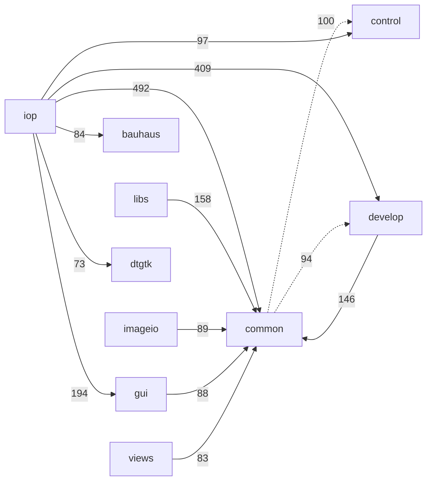
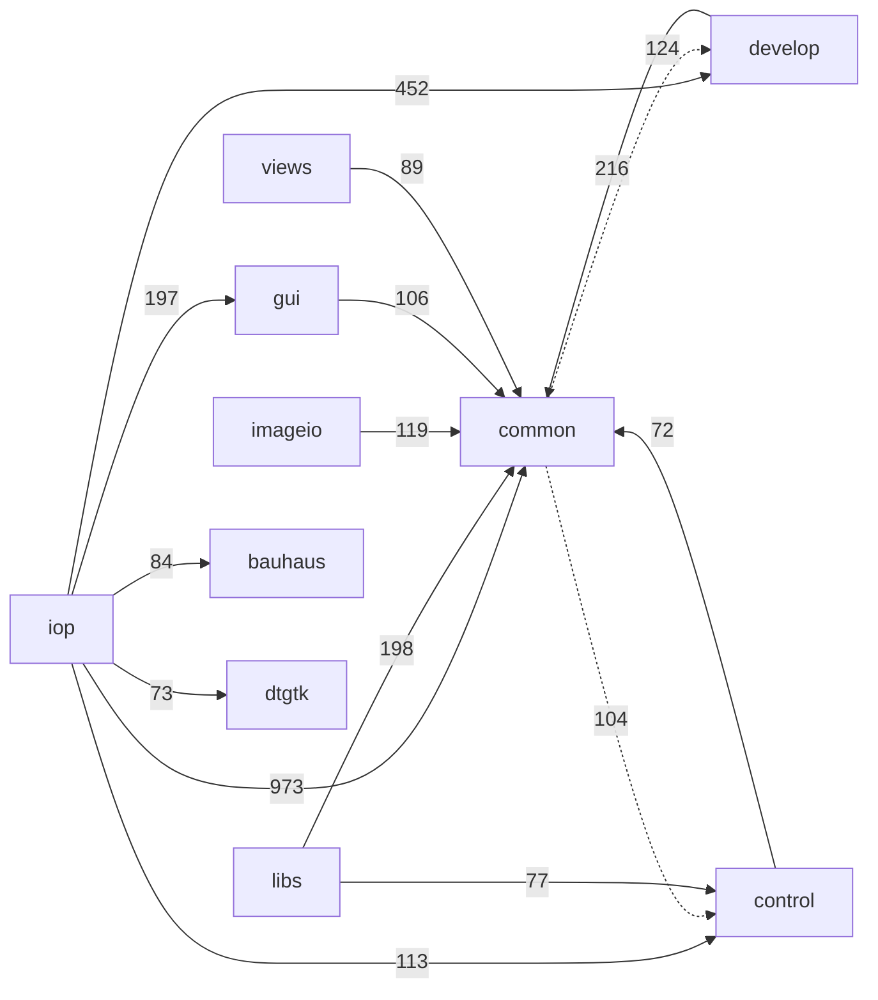

# The include dependency graph: before / after

Measured with `tools/include_graph.py` (static analysis of `#include "..."` edges under `src/`,
project headers only). Reproduce either side with:

```sh
python3 tools/include_graph.py --summary          # metrics, for before/after diffing
python3 tools/include_graph.py --mermaid          # directory-level graph
python3 tools/include_graph.py                    # cycles, inversions, god-headers, full detail
```

"Before" is `master` at the point this series branched; "after" is the tip of
`refactor/strip-darktable-h`.

## Headline

| metric | before | after | |
|---|---:|---:|---|
| `cycles` | 3 | **0** | the graph is a DAG |
| `cycle_nodes` | 13 | **0** | |
| `total_transitive_edges` | 30578 | **27999** | −8.4% |
| `mean_closure` (per header) | 19.5 | **13.6** | −30% |
| `tu_median_closure` (headers per TU) | 76 | **65** | −14% |
| `tu_mean_closure_lines` | 16967 | **15355** | −9.5% |
| `darktable_h_reach` | 517 | **17** | −97% |
| `darktable_h_direct_includers` | 343 | **16** | −95% |
| `max_closure` | 84 | **82** | |

`darktable_h_reach` is the number of files that reach `darktable.h` transitively — i.e.
how much of the codebase the application orchestrator is welded to. That is the number this
whole series exists to move.

## Two metrics that look worse and are not

**`direct_edges` 4294 → 5356.** One umbrella include is replaced by the three or four specific
headers a file actually uses. More edges, each of them honest and cheap. This is why the
line-weighted metrics below matter more than the edge count.

**`layering_violations` 331 → 372.** These inversions always existed; `darktable.h` was hiding
them behind a single umbrella edge. When `common/imageio_module.c` stopped including the
orchestrator, it had to say out loud that it calls `gui/gtk.h`. Making them visible is a
precondition for fixing them. The two dominant ones are the next target:

| inversion | count |
|---|---:|
| `common/ → develop/` | 124 |
| `common/ → control/` | 104 |
| `common/ → gui/` | 32 |
| `gui/ → develop/` | 28 |

## Why node-counting is the wrong metric, and what replaced it

Counting *nodes* in a transitive closure rewards monoliths. `master`'s `darktable.h` was
a 1277-line header that **defined** its content inline: it counted as **one node dragging in
nine headers**. The same content split into eleven honest headers (`macros.h`, `mem_alloc.h`,
`simd.h`, `openmp.h`, `logging.h`, …) counts as up to eleven — so a naive node metric got
*worse* mid-migration while every individual file was getting cheaper.

`tools/include_graph.py --summary` therefore also reports closure weighed by each header's own
line count (`tu_*_closure_lines`), which is what the preprocessor actually eats. That is the
metric to quote.

## The cycles, and what they had in common

All three had the same root cause: **a trailing "convenience" `#include` at the bottom of a
header**, pulling in a header that includes it right back. `#pragma once` is the only reason
this ever compiled — which is the anti-pattern the `#pragma once` removal is meant to expose.

```
BEFORE (3 SCCs, 13 nodes)

  common/iop_profile.h ─→ develop/imageop.h ─→ common/opencl.h ─┐
         ▲                      │  │                            │
         └──────────────────────┼──┼────────────────────────────┘
                                │  └─→ gui/gui_throttle.h ─┐
                                ▼                          ▼
                    develop/pixelpipe.h ─→ develop/pixelpipe_hb.h
                                ▲                          │
                                └──────────────────────────┘

  control/control.h ⇄ control/jobs.h ⇄ control/jobs/{control,film,image}_jobs.h

  develop/masks.h ⇄ develop/masks/masks_history.h
```

The cuts, each justified by what the header actually needs:

- `develop/pixelpipe.h` no longer trailing-includes `develop/pixelpipe_hb.h`. It is the small
  shared **type** header (pipe type/request enums, histogram params).
- `control/jobs.h` no longer trailing-includes the three `control/jobs/*_jobs.h`. Those needed
  only `dt_job_t`, so they include `control/jobs.h` instead of `control/control.h`.
- `develop/masks/masks_history.h` no longer includes `develop/masks.h` — which must include
  *it* at the bottom, since `dt_masks_form_t` has to be complete first. All five declarations
  take their arguments by pointer, so tag declarations suffice.
- `common/iop_profile.h` no longer includes `develop/imageop.h`: every type it used was already
  tag-declared and used only through a pointer. This was also a `common/ → develop/` inversion.

The last edge, `imageop.h ⇄ pixelpipe_hb.h`, is the interesting one. Cutting it on the *module*
side would have rippled into ~100 iop modules, all of which name `dt_dev_pixelpipe_t` in their
`process()` signatures. It is cut on the *data* side instead: `pixelpipe_hb.h` already only
tag-declared `dt_iop_module_t`, so its sole remaining need was `dt_iop_roi_t` — plain raster
geometry, not module API. That struct moved to `develop/format.h` beside `dt_iop_buffer_dsc_t`,
`pixelpipe_hb.h` now includes `format.h`, and `imageop.h` includes `pixelpipe_hb.h`. Every iop
module sees exactly what it saw before; **zero module churn**.

Same reasoning rehomed `dt_sfence()` / `dt_omploop_sfence()` from `develop/imageop.h` to
`system/openmp.h`: memory-fence helpers with no module API involvement, already used by
`common/interpolation.c` and `common/iop_profile.c`.

## Directory graph

Dotted edges are layering inversions. Edge labels are direct include counts.

### Before



### After



`iop → common` roughly doubles: that is the umbrella replaced by explicit, individually cheap
leaf headers. `common/` is now the bottom of the graph in fact and not only in intent — its
top fan-in headers (`macros.h`, `mem_alloc.h`, `openmp.h`, `simd.h`, `dtpthread.h`) each drag
in **zero or one** other project header.

## `#pragma once` is gone

All 259 headers that used `#pragma once` now carry an explicit
`#ifndef DT_<PATH>_H` guard, plus 17 headers that had **no guard at all** (a latent
double-inclusion bug each). Converted mechanically with `tools/pragma_once_to_guards.py`;
`--verify` re-runs the check and exits non-zero if one reappears. The rule and its rationale
are in `CLAUDE.md`.

Five headers deliberately keep no guard and no includes of their own — `common/module_api.h`,
`views/view_api.h`, `libs/lib_api.h`, `imageio/{format,storage}/imageio_*_api.h`. They are
X-macro headers: re-included several times per translation unit with different macros defined,
and expanded *inside struct bodies* to generate members. An `#include` at the top of one of them
lands inside those structs — a mistake worth making exactly once.

## `darktable.h` carries a tripwire, not a guard

It has no include guard. A second inclusion in one translation unit is never legitimate
for the orchestrator, so instead of absorbing it silently the header `#error`s. That is
the same principle as banning `#pragma once`, taken to its end for the one header where
"included once" is a real invariant rather than a convenience.

Installing it immediately caught what several greps had missed: `common/colorchecker.h`
— a *header* — plus `colorchecker.c` and `sqliteicu.c` were including it as
`#include "darktable.h"` (relative to `src/common/`), not `#include "darktable.h"`.
All three were vestigial and are gone. Audit this with `grep -r 'darktable\.h"'`; the
qualified spelling alone under-reports.

## What is left

1. **The `common/ → develop/` (124) and `common/ → control/` (104) inversions.** Now explicit.
   Mostly `common/` code calling `dt_control_*` / `dt_conf_*` and reaching into pipeline types.
2. **Removing `#pragma once`** in favour of include guards is now *possible* — the graph being a
   DAG is the precondition. Needs a maintainer decision.
3. **The 12 `.c` files that still include `darktable.h`** — and they are the right ones:
   four application entry points (`main.c`, `cli/main.c`, `cltest/main.c`,
   `generate-cache/main.c`) calling `dt_init()`/`dt_cleanup()`; six subsystem owners that
   *are* the thing the global names (`darktable.c`, `control.c`, `gtk.c`, `opencl.c`,
   `conf.c`, `imageop.c`, `exif.cc`); and `dbus.c` for `dt_load_from_string()`. No header
   includes it at all. The rest of the globals census is in `doc/globals-migration.md`.
4. **Dead code the build never compiles**, found while sweeping: `src/iop/useless.c` (commented
   out of `iop/CMakeLists.txt`) and `src/apps/ansel-chart/{main,colorchart,pfm,tonecurve}.c` (only
   `chart/common.c` is built). `useless.c` and `chart/{main,colorchart}.c` do not compile at all
   any more, independently of this series — verified by building pristine `HEAD` copies.
